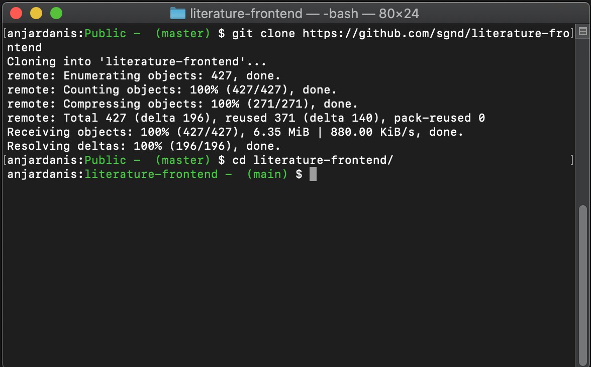
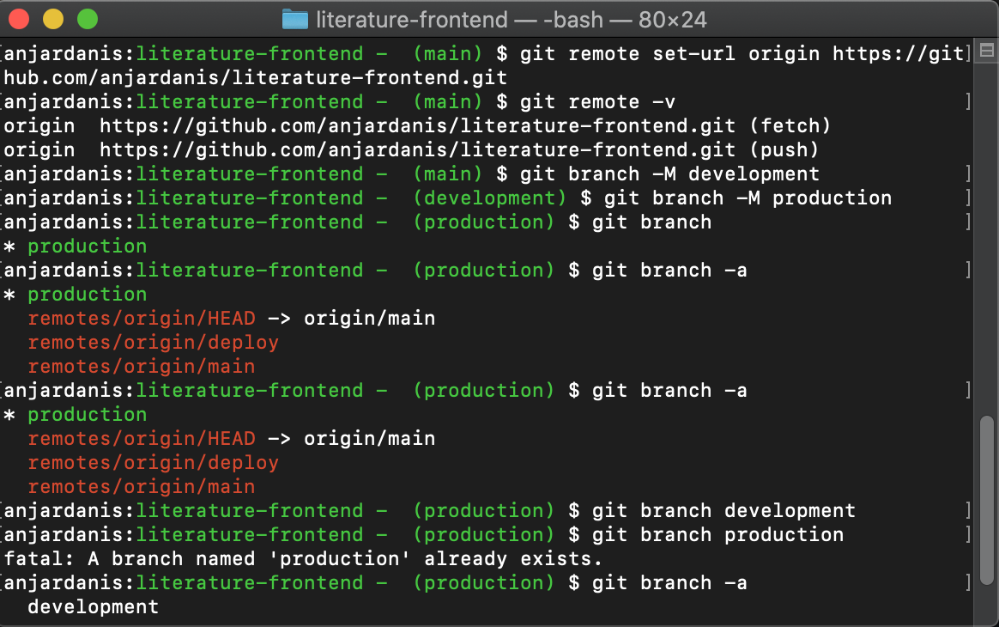
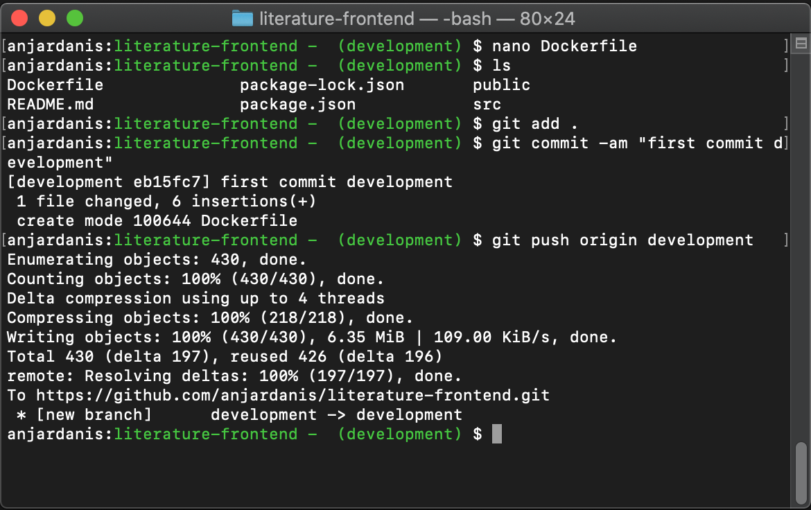
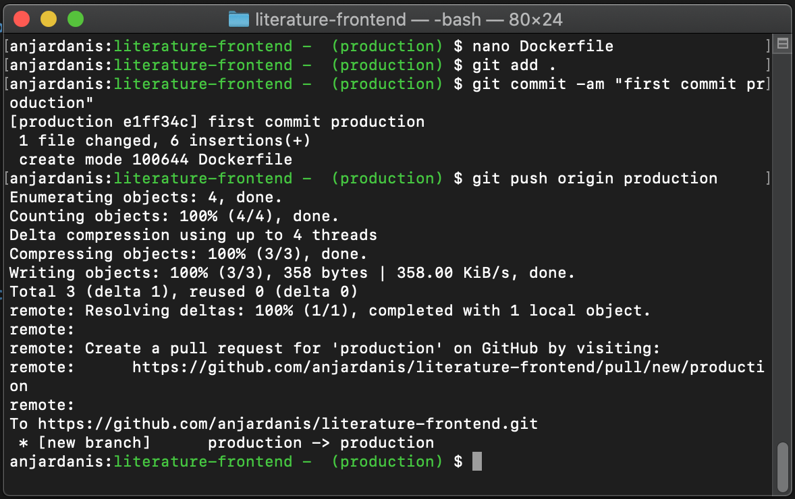
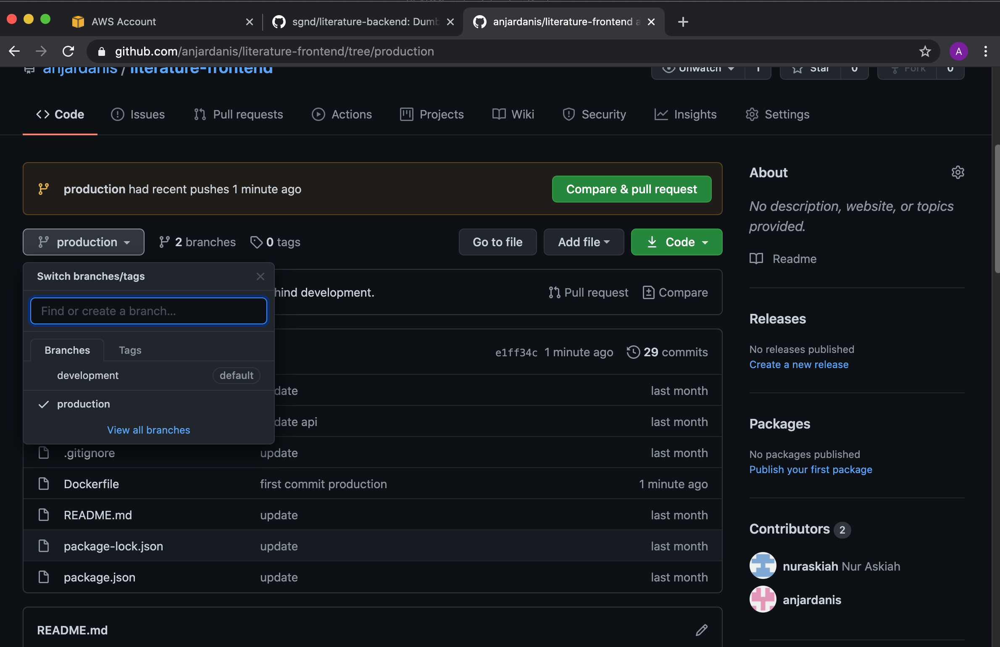
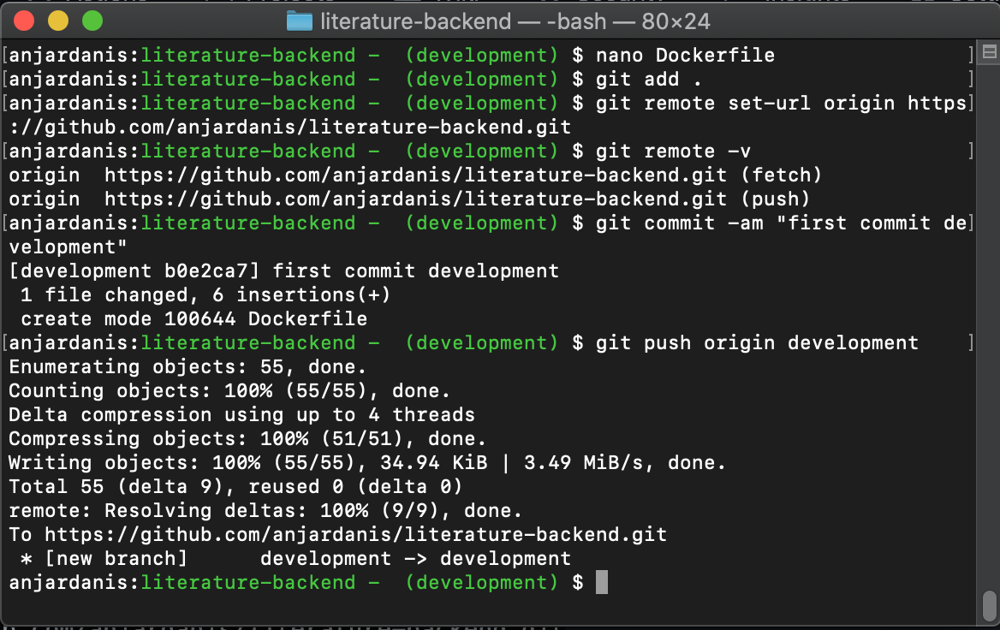
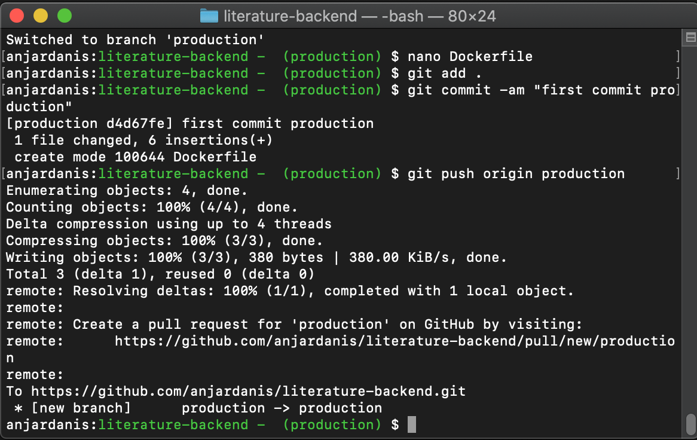
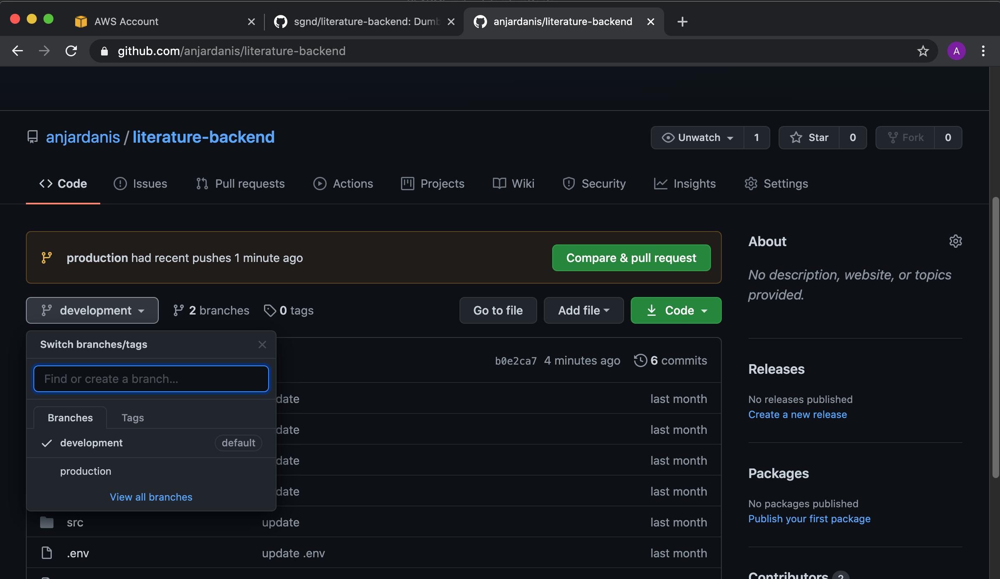

# Repository

## Frontend
#### Git Clone https://github.com/sgnd/literature-frontend pada lokal


#### ubah set-url githubnya dan tambahkan branch development dan production


#### pada branch development tambah Dockerfile dan push 
```
FROM node:10
WORKDIR /usr/app
COPY . .
RUN npm install
EXPOSE 3000
CMD ["npm","start"] 
```


#### Lakukan pada branch production juga tetapi isi Dockerfile diubah
```
FROM node:10
WORKDIR /usr/app
COPY . .
RUN npm install
RUN npm run build
RUN npm install -g serve
EXPOSE 5000
CMD ["serve","-s","build"] 
```




## Backend
#### git clone https://github.com/sgnd/literature-backend pada lokal sama seperti frontend tetapi teradapat perbedaan pada Dockerfile production dan development
```
FROM node:10
WORKDIR /usr/app
COPY . .
RUN npm install
EXPOSE 5000
CMD ["npm","start"] 
```


#### pada production dockerfile
```
FROM node:10
WORKDIR /usr/app
COPY . .
RUN npm install
EXPOSE 5000
CMD ["npm","start","NODE_ENV=production"] 
```

