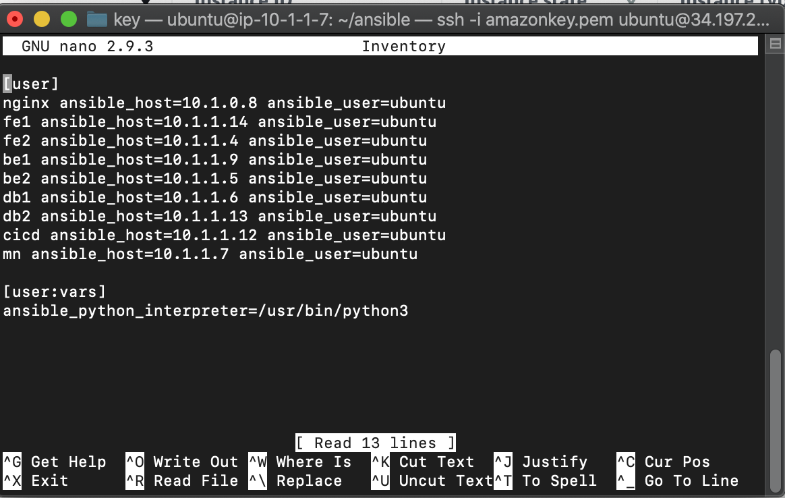
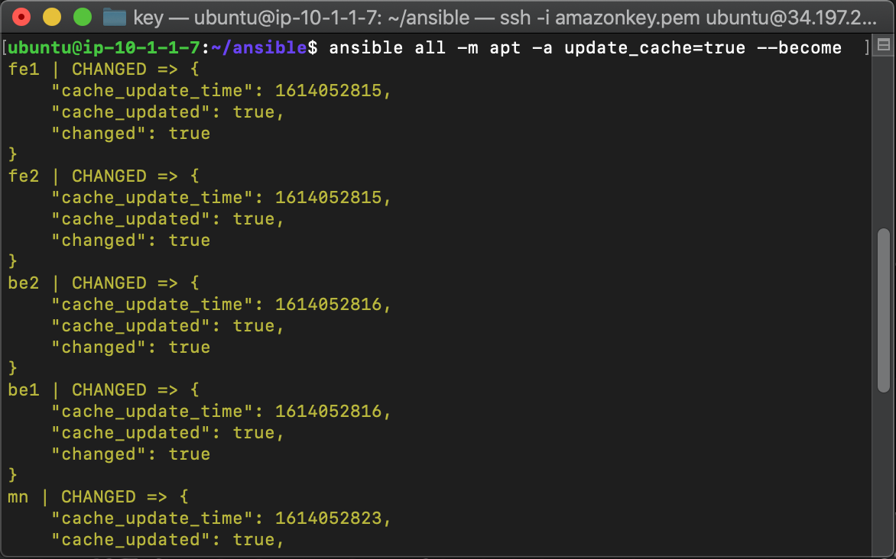

# User

#### Install Ansible dengan script


#### Jalankan dengan chmod +x dan ./


#### git clone repo ansible




#### cek ssh target server menggunakan ssh key


#### cek ping ke semua server target


#### lakukan apt update dan apt upgrade dengan command
```
ansible all -m apt -a update_cache=true --become
ansible all -m apt -a "upgrade=dist" --become
```



#### install docker dan docker compose plus install node exporter


#### Buat User baru dan ssh-keygen

