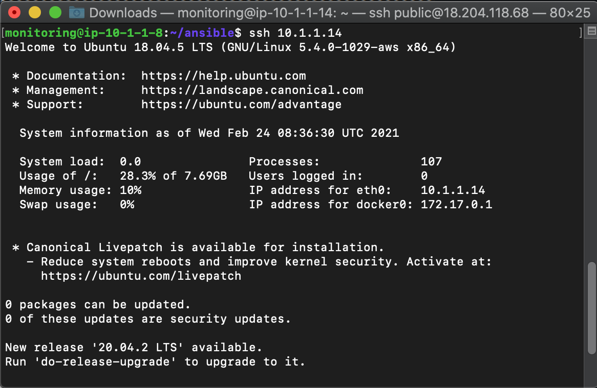

# SSH

#### Lakukan SSH-copy-id dari ansible server ke target server

#### tambahkan config

#### lakukan SSH hanya menggunakan user

#### untuk ssh hanya menggunakan IP buat universal user

#### tambahkan ssh-copy-id dan lakukan ssh hanya menggunakan IP
