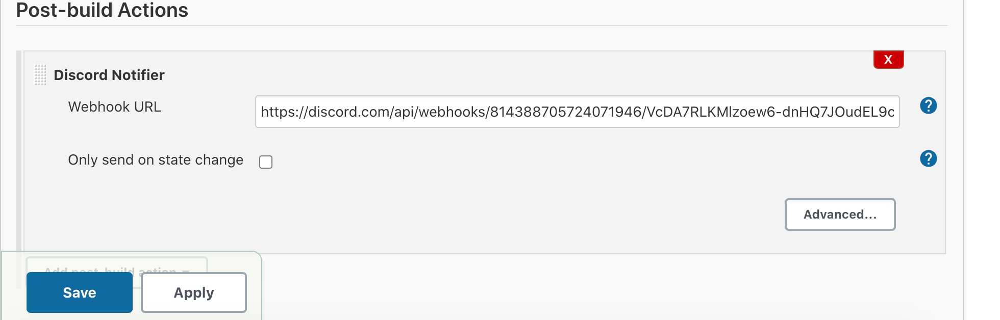

# Jenkins

#### Run Jenkins Docker dari Server Ansible


#### Cat password jenkins dengan command 
```
ansible cicd -m shell -a 'docker exec cicd cat /var/jenkins_home/secrets/initialAdminPassword' -bK
```


#### Masukkan Password Jenkins


#### Install Plugin Publish Over SSH dan Discord Notifier


#### Buat Token untuk menghubungan jenkins dan github


#### Buat Credential username github
 

#### tambahkan webhook gituhub di konfigurasi jenkins


#### SSH-copy-id dari server jenkins ke frontend dan backend server


#### tambahkan konfigurasi jenkins di publish over ssh menggunakan id_rsa private
 


#### Buat Jenkins Job untuk frontend dan backend


```
cd /home/frontend01/literature-frontend
git pull origin production
docker-compose down
docker rmi anjardanis/literature-frontend
docker build -t anjardanis/literature-frontend .
docker-compose up -d
```





```
cd /home/backend01/literature-backend
git pull origin production
docker-compose down
docker rmi anjardanis/literature-backend
docker build -t anjardanis/literature-backend .
docker-compose up -d
```

