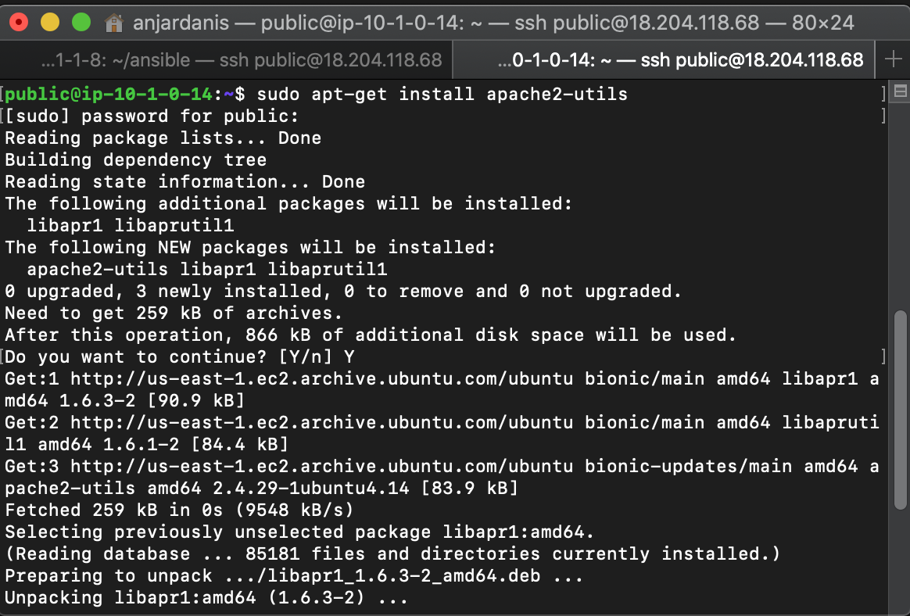

# Auth

#### Install apache2-utils dan buat password 
```
sudo apt-get install apache2-utils
sudo htpasswd -c ~/.htpasswd admin
```



#### edit file prometheus.conf dan tambahkan sesuai gambar
```
auth_basic "Prometheus";
auth_basic_user_file ~/.htpasswd;
```


#### cek pada prometheus


#### tambahkan auth basic di grafan
