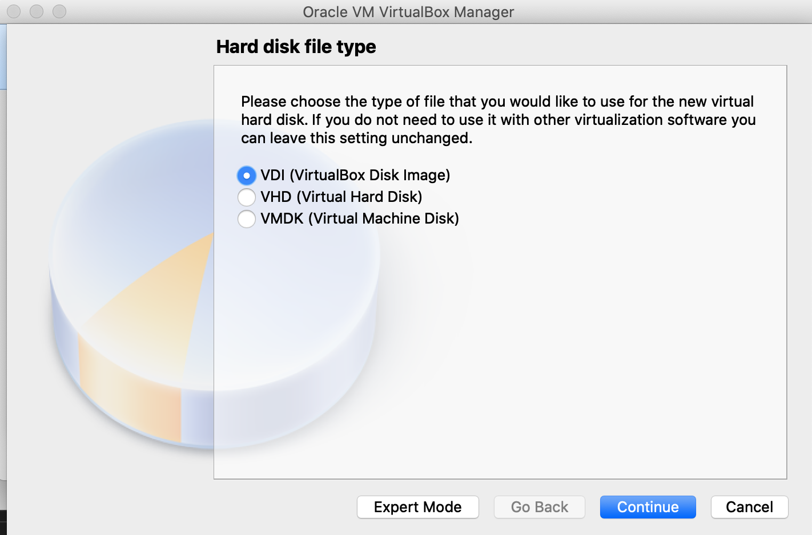
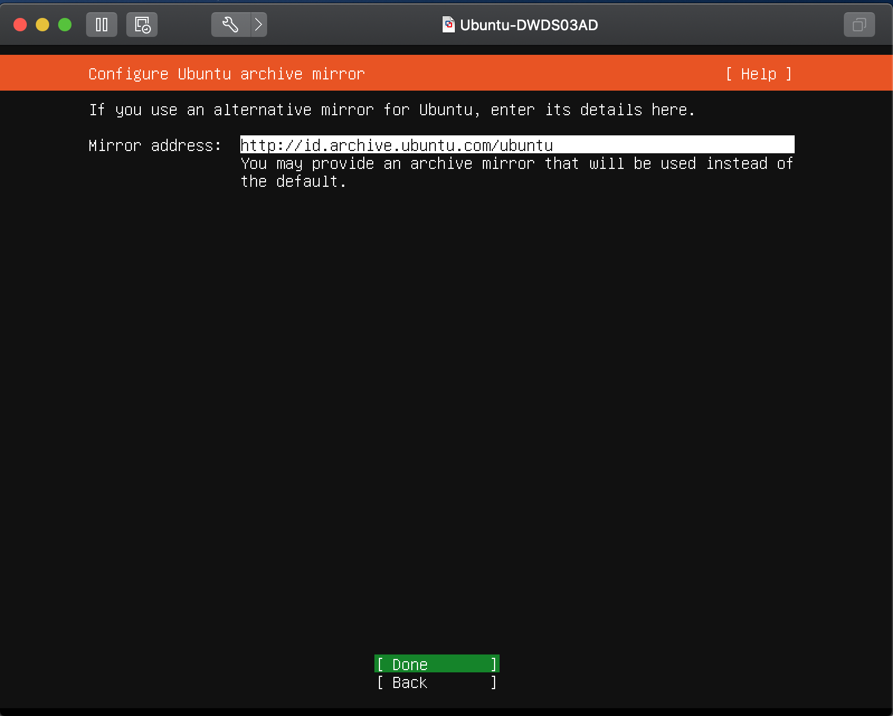

# VMware - Install Ubuntu Server

* #### Klik New

* #### Isi Nama File dan Pilih Ubuntu 64 Bit

* #### Ubah Memory 2 Gb

* #### Create Virtual Harddisk

* #### Pilih VDI ( VirtualBox Disk Image)

* #### Pilih Dynamic Allocate

* #### Pilih Size 15 GB

* #### Klik Setting Ubah Network menjadi Bridge

* #### Klik Storage Pilih ISO Ubuntu 18.04

* #### Lalu Klik Play

* #### Lalu Pilih Bahasa Inggris dan Continue Without Updating

* #### Lalu Klik Done Pada Pengaturan Keyboard, IP, Proxy, dan Mirror

* #### Pilih Custom layout (Menggunakan Spasi Untuk Ceklis) Kemudian Klik Done

* #### Pilih Adding GPT Partition 1 GB Untuk Format Swap dan Sisanya Untuk Format Ext4

* #### Kemudian Done dan Pilih Continue

* #### Isi Profile

* #### Pilih Ceklis atau X untuk Install OpenSSH Server

* #### Kemudian Pilih Done dan Menunggu Install dan Reboot Server

