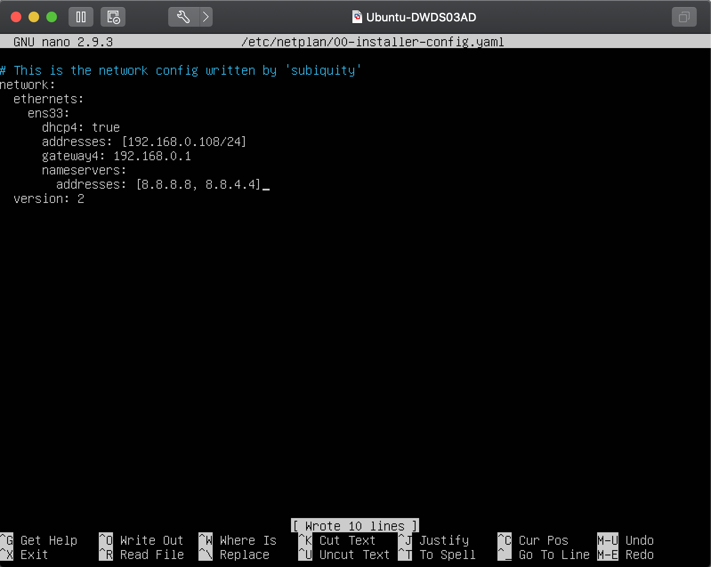
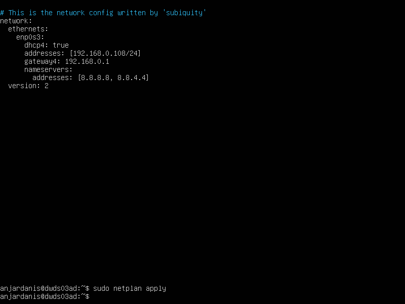
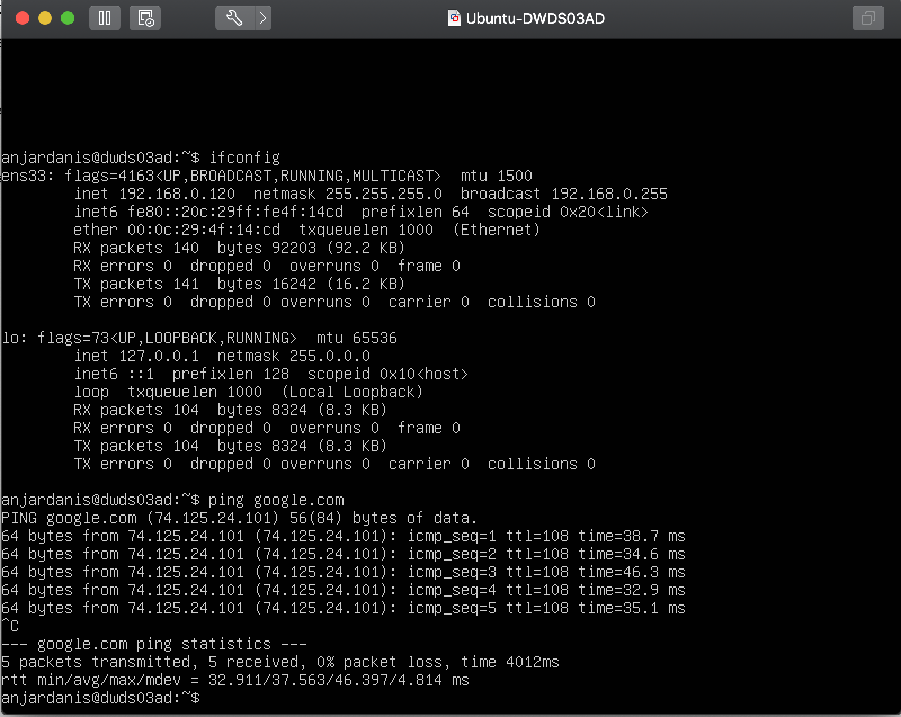

# VMware - Setup Network

* #### Ubah IP Menjadi Static Menggunakan Command
    `sudo nano /etc/netplan/00-installer-config.yaml`

* #### Isi File yaml seperti pada gambar dengan address 192.168.0.108/24 dengan DNS google [8.8.8.8, 8.8.4.4] 

* #### kemudian Command `sudo netplan apply`

* ### Cek IP menggunakan Command `ifconfig` dan Melalukan Ping Ke Google.com
