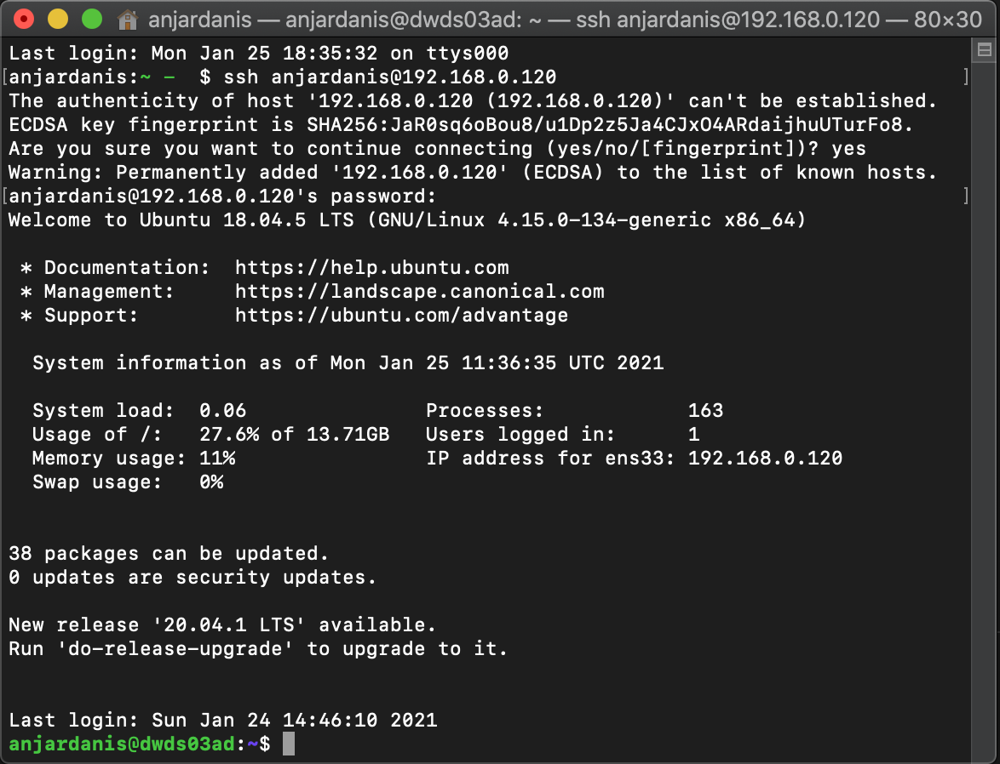
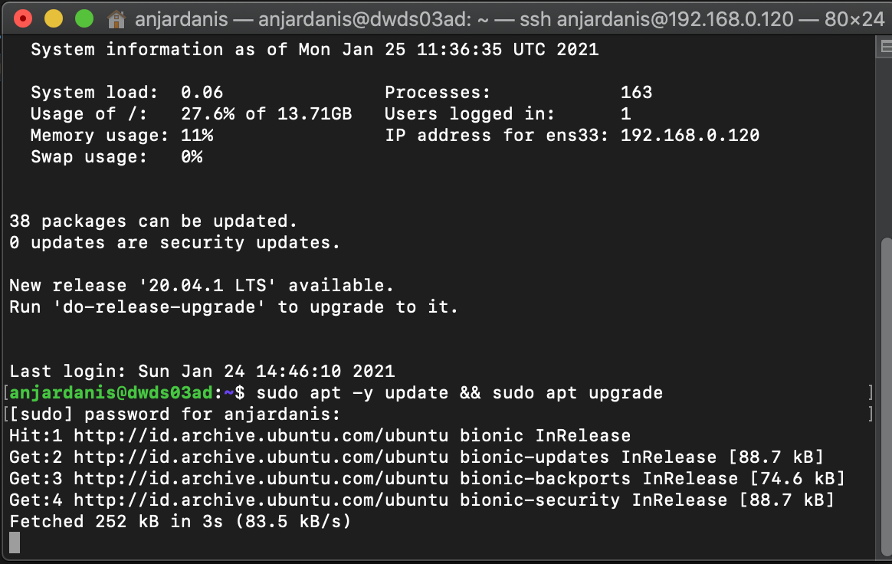
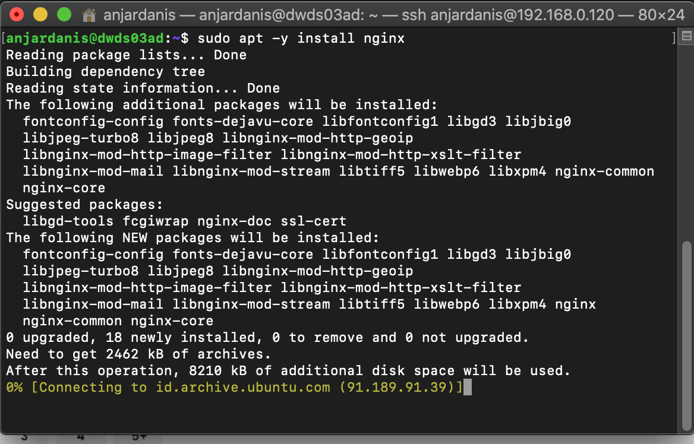
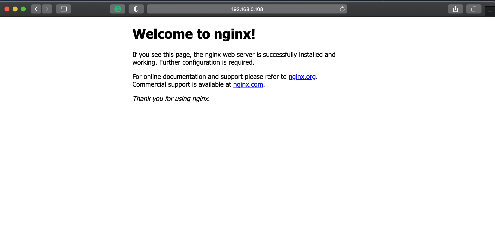
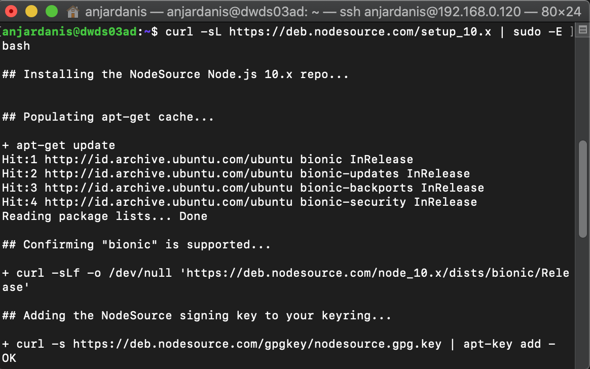
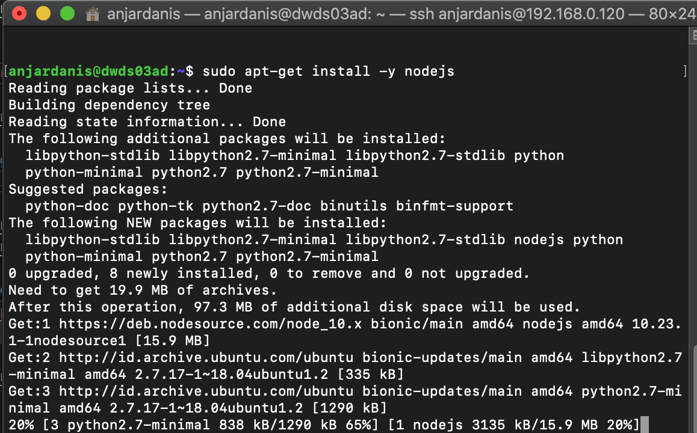
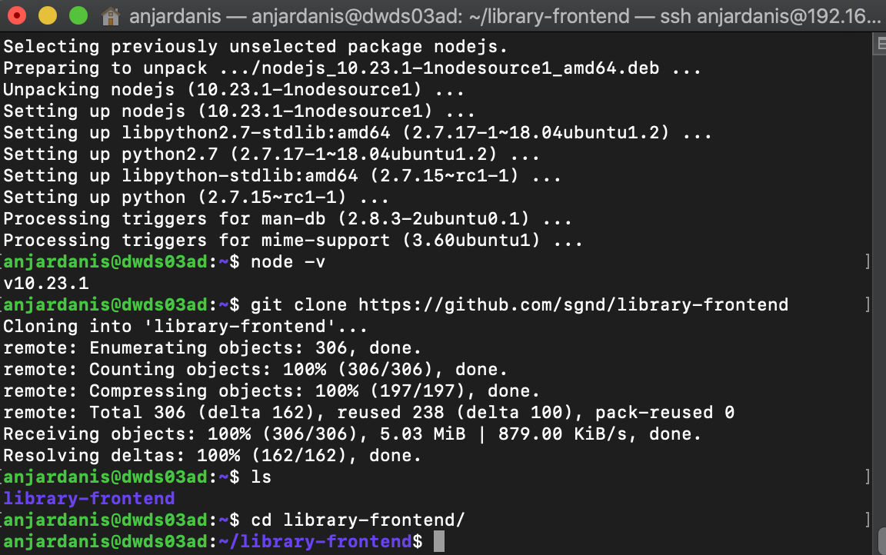
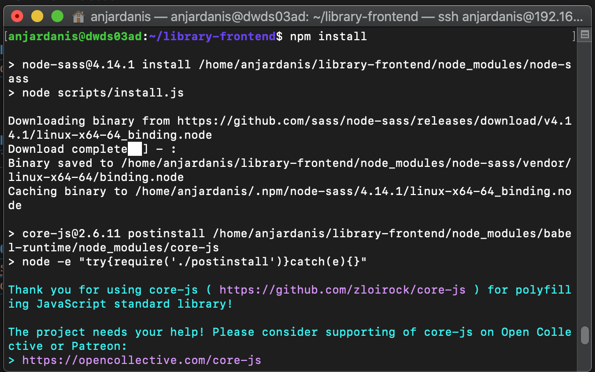
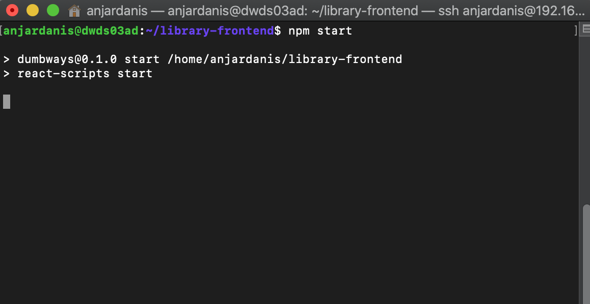
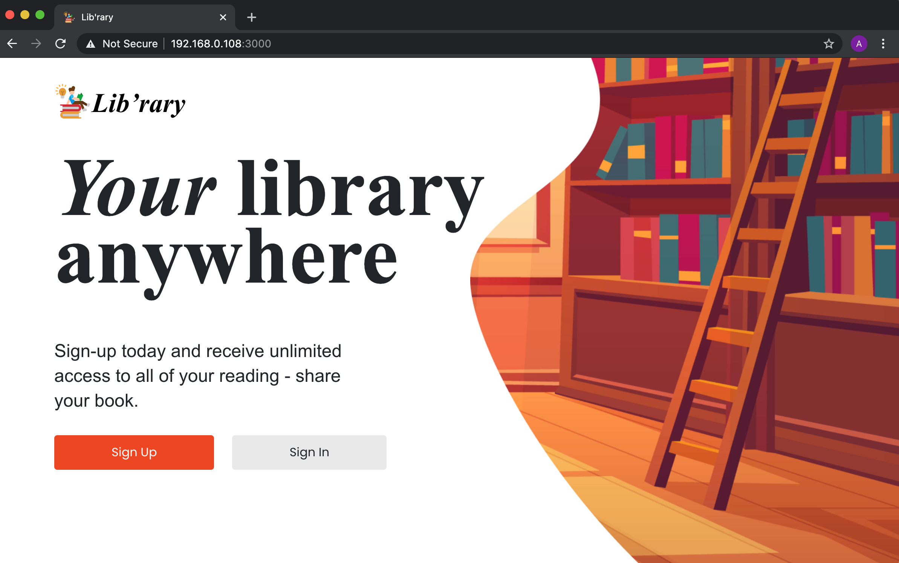

# VMware - Install Application

* #### Lakukan SSH Server dari Terminal Macbook


* #### Update Server menggunakan Command
    `sudo apt -y update && sudo apt -y upgrade`



* #### Install Nginx Menggunakan Command dan Buka Dibrowser
    `sudo apt -y install nginx`




* #### Install Nodejs Versi 10 Menggunakan Command
    ```
    curl -sL https://deb.nodesource.com/setup_10.x | sudo -E bash
    sudo apt-get install -y nodejs
    ```




* #### Clone Repo Library dan Masuk Ke Direktori dengan menggunakan Command
    `git clone https://github.com/sgnd/library-frontend`



* #### Lakukan Install npm package dan deploy dengan Command
    ```
    npm install
    npm start
    ```




* #### Buka Browser Masukkan Ip Adresses dengan port 3000


