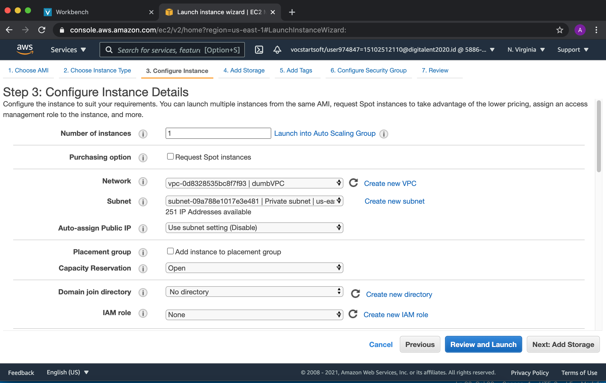
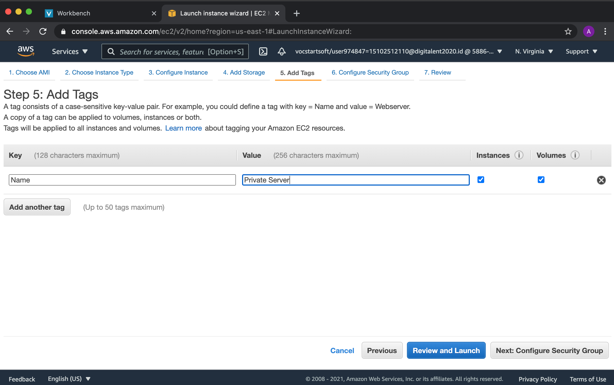

# AWS - Create and Setup Server

## Pertama Buat Virtual Private Cloud (VPC)

* #### 1. Membuat Elastic IP untuk Nat-Gateway
Klik Allocate Elastic IP Addres

Kemudian Isi Tag Sesuai Gambar dan Klik Allocate

* #### 2. Buat VPC baru 
Klik Launch VPC Wizard

Pilih VPC with Public and Private Subnet dan klik Select

Isi Sesuai Pada Gambar Nama: DumbVPC ; IPv4 CIDR: 10.0.0.0/16 ; Public Subnet: 10.0.0.0/24 ; Private Subnet: 10.0.1.0/24
Elastic IP yg sudah dibuat akan digunakan di Elastic IP Allocation ID

Kemudian Klik Create VPC

Untuk bagian Route Table, NAT Gateway sudah dibuat dapat dicek ditab Route Table dan berikan Nama Untuk Route Tables
Yang tersambung dengan Internet Gateway adalah Public Route Table dan yang tersambung dengan NAT adalah Private Route table

Kemudian Untuk Private Route Table attach dengan Private Subnet. dengan cara Pilih Private Route Table klik edit subnet associations

Pilih Private Subnet dan klik Save

## Kedua Membuat Public Ubuntu Server dan Private Ubuntu Server

* #### 1. Membuat EC2 Instance untuk Public Server
Klik Launch Instances

Pilih Ubuntu Server 18.04 LTS (HVM), SSD Volume Type Lalu Klik Select

Kemudian Pilih Next:Configuration Instance Detail

Untuk Bagian Network diganti dengan VPC: dumbVPC ; Subnet : Public Subnet Karena Public Server ; Autoassign: Enable Lalu Klik add storage

Untuk Storage dibiarkan default yaitu 8 Gb Kemudian Klik add tags

Untuk Tags Tambahkan Tag Sesuai gambar untuk memudahkan Lalu Klik Next:Configure Security Group

Untuk bagian Security Group Isi Seperti pada Gambar. Lalu Klik Review and Launch dan Klik Launch
Port 22: Untuk SSH Ke Server
Port 80: Untuk HTTP
Port 443: Untuk HTTPS

Keypair digunakan untuk SSH ke Server jika Belum membuat dibuat terlebih dahulu. Jika sudah klik launch Instances

Kemudian Gunakan Elastic IP untuk Public Server

Kemudian Pilih Elasic yg baru dibuat dan klik Assosicate Elastic IP Address

Pilih Instance Public Server yg baru dibuat dan Klik Associate

Hasil Terakhir:

* #### 2. Membuat EC2 Instance untuk Private Server

Klik Launch Instances

Pilih Ubuntu Server 18.04 LTS (HVM), SSD Volume Type Lalu Klik Select

Kemudian Pilih Next:Configuration Instance Detail

Untuk Bagian Network diganti dengan VPC: dumbVPC ; Subnet : Private Subnet Karena Private Server ; Autoassign: disable Lalu Klik add storage

Untuk Storage dibiarkan default yaitu 8 Gb Kemudian Klik add tags

Untuk Tags Tambahkan Tag Sesuai gambar untuk memudahkan Lalu Klik Next:Configure Security Group

Untuk bagian Security Group Isi Seperti pada Gambar. Lalu Klik Review and Launch dan Klik Launch
Port 22: Untuk SSH Ke Server dikarenakan untuk Keamanan Maka Port 22 Sourcenya adalah Security Group Public Server
Port 80: Untuk HTTP
Port 443: Untuk HTTPS
Port 3000: Untuk Deploy Frontend

Keypair digunakan untuk SSH ke Server jika Belum membuat dibuat terlebih dahulu. Jika sudah klik launch Instances

Hasil Terakhir:
[29](assets/29.png)

* #### 3. SSH ke Public Server Menggunakan Terminal Macbook Air
Pilih Public Server Kemudian Klik Connect

Pilih SSH Client

Buka Terminal dan Pindah ke Direktori Terdapat keypair

Copy Nomor 3 Yaitu `chmod 400 amazonkey.pem` dan bagian example `ssh -i "amazonkey.pem" ubuntu@ec2-34-233-242-103.compute-1.amazonaws.com`

Hasil Terakhir dpt SSH ke Server Public

* #### 4. Membuat New User di Public Server dan SSH Menggunakan password
Membuat User baru dengan Command
`sudo adduser anjardanispublic`

Kemudian usermod User anjardanispublic dengan Command bertujuan untuk user tidak perlu menggunakan command dengan sudo didepannya
`sudo usermod -aG sudo anjardanispublic`

Kemudian edit file `/etc/ssh/sshd_config` dan ubah PasswordAuthentication menjadi Yes

Kemudian Restart dan Exit sshd Menggunakan Command
`sudo systemctl restart sshd`

Kemudian SSH kembali dengan command `ssh user@ip` yaitu:
`ssh anjardanispublic@34.233.242.103`

* #### 5. SSH Private Server dari Public Server
Dikarenakan Default Server AWS menggunakan keypair maka copy keypair ke dalam Public Server dengan cara membuat file keypair

Kemudian Sama dengan Langkah public Server Pilih Private Server dan Klik Connect dan kebagian SSH Client

Copy Langkah nomor 3 dan example

Hasil Akhir:

* #### 6. Membuat New User di Private Server dan SSH Menggunakan password
Membuat User baru dengan Command
`sudo adduser anjardanisprivate`

Kemudian usermod User anjardanispublic dengan Command bertujuan untuk user tidak perlu menggunakan command dengan sudo didepannya
`sudo usermod -aG sudo anjardanisprivate`

Kemudian edit file `/etc/ssh/sshd_config` dan ubah PasswordAuthentication menjadi Yes

Kemudian Restart dan Exit sshd Menggunakan Command
`sudo systemctl restart sshd`

Kemudian SSH kembali dengan command `ssh user@ip` yaitu:
`ssh anjardanisprivate@10.0.1.109`
