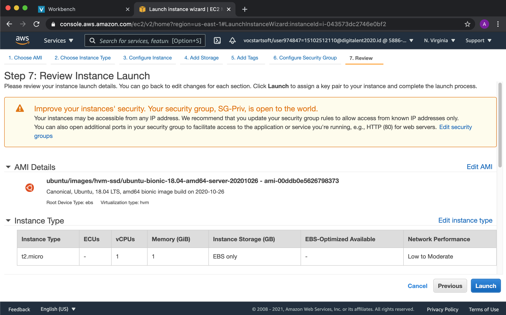
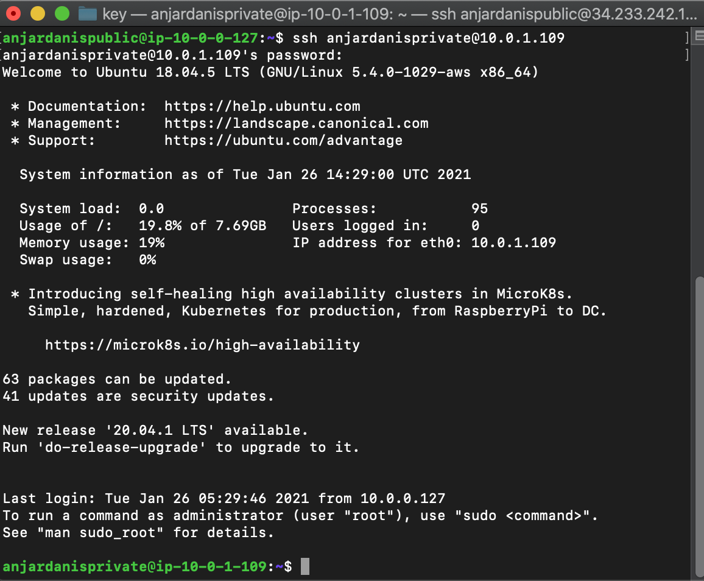

# AWS - Server for Application

* #### 1. Persiapan Frontend Applikasi Library di Private Server
Pertama Ubah Nama Private Server menjadi Application-Frontend-1


Duplicate Application-Frontend-1 dengan cara Pilih Servernya Klik Action > Images & Templates > Launch More Like This


Kemudian Klik Launch dan Ubah Namanya Menjadi Application-Frontend-2



* #### 2. Deploy Applikasi Library di Application-Frontend-1 dan Application-Frontend-2
* ##### Application-Frontend-1
SSH ke Server Application-Frontend-1 Melalui Public Server


Update dan Upgrade OS dengan Command
`sudo apt update && sudo apt -y upgrade`


Kemudian Install Nodejs Versi 10 dengan Command
```
curl -sL https://deb.nodesource.com/setup_10.x | sudo -E bash
sudo apt-get install -y nodejs
```


Clone Repo Library dan Masuk Ke Direktori dengan menggunakan Command
    `git clone https://github.com/sgnd/library-frontend`


Buat file baru bernama `ecosystem.config.js` dan isi dengan pengaturan PM2


Kemudian Install npm pm2 dengan command
    `sudo npm install -g pm2`


Kemudian Jalankan pm2 dengan command
    `pm2 start ecosystem.config.js`


* ##### Application-Frontend-2
Hampir sama dengan Application-Frontend-1 tetapi membuat username seperti pada Task 04 terlebih dahulu

Hasil Akhir Application-Frontend-2
