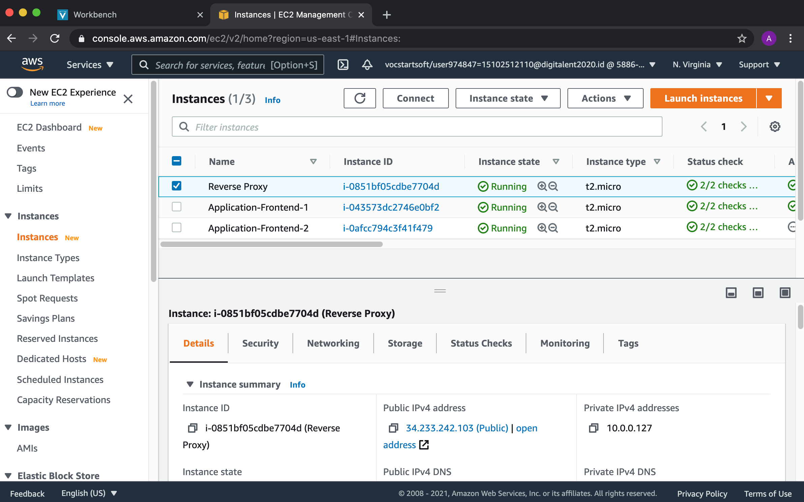
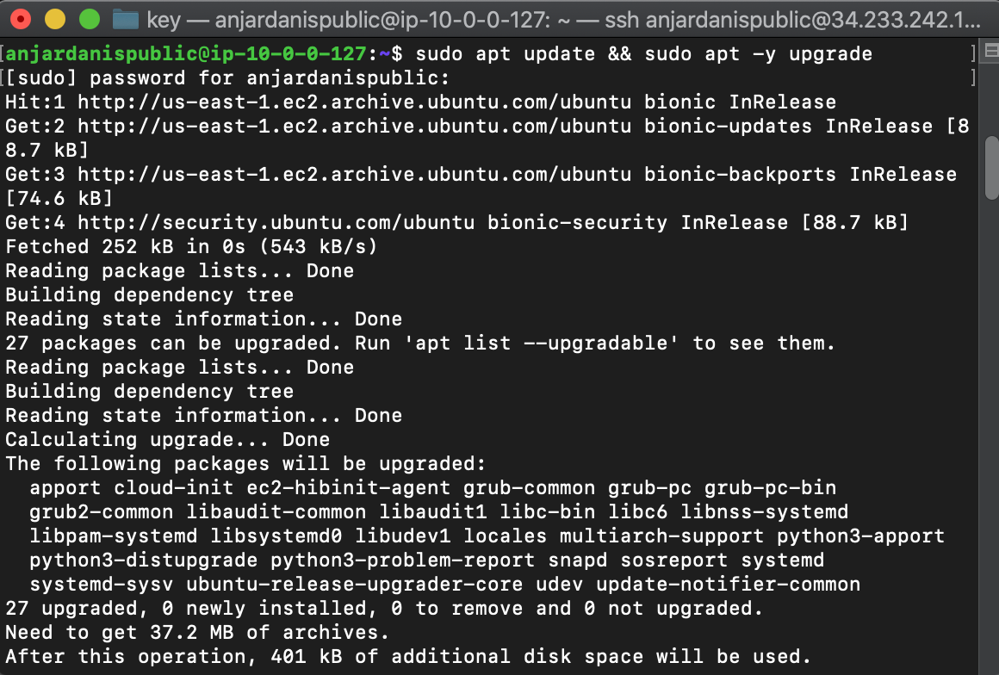
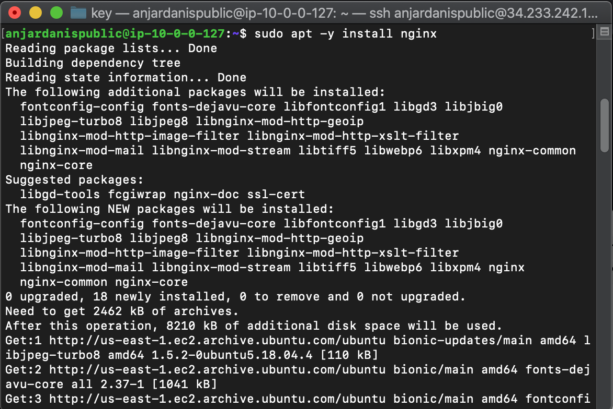
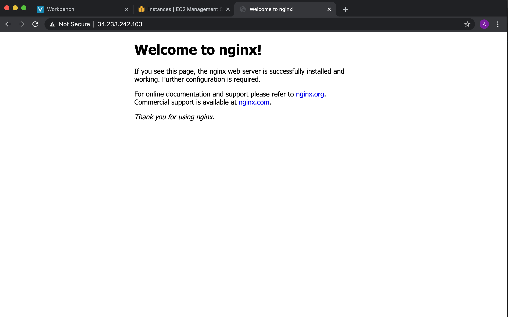
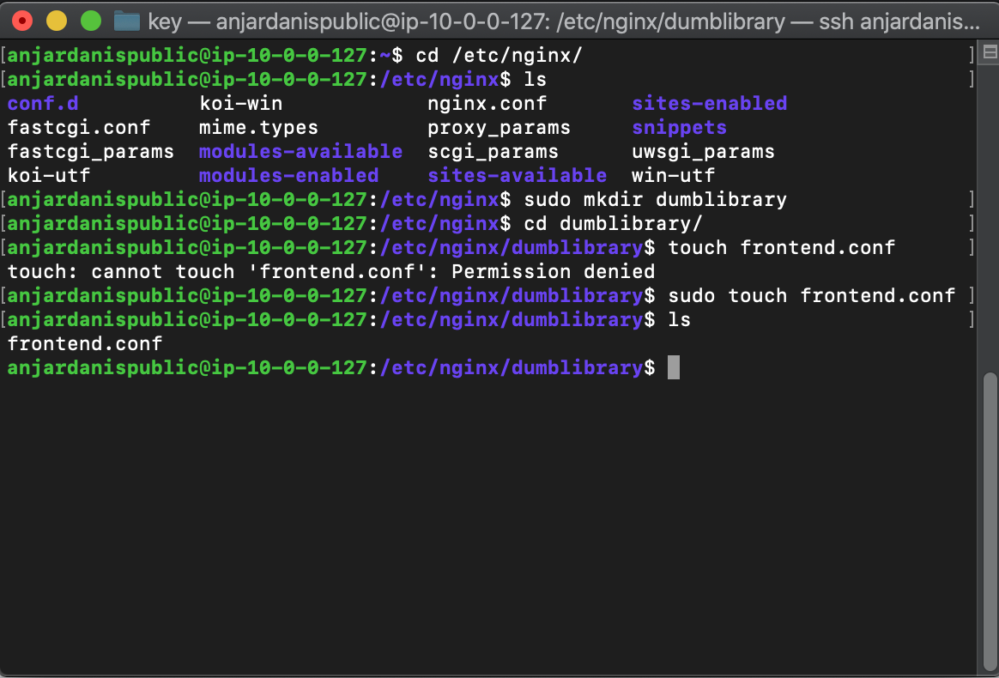
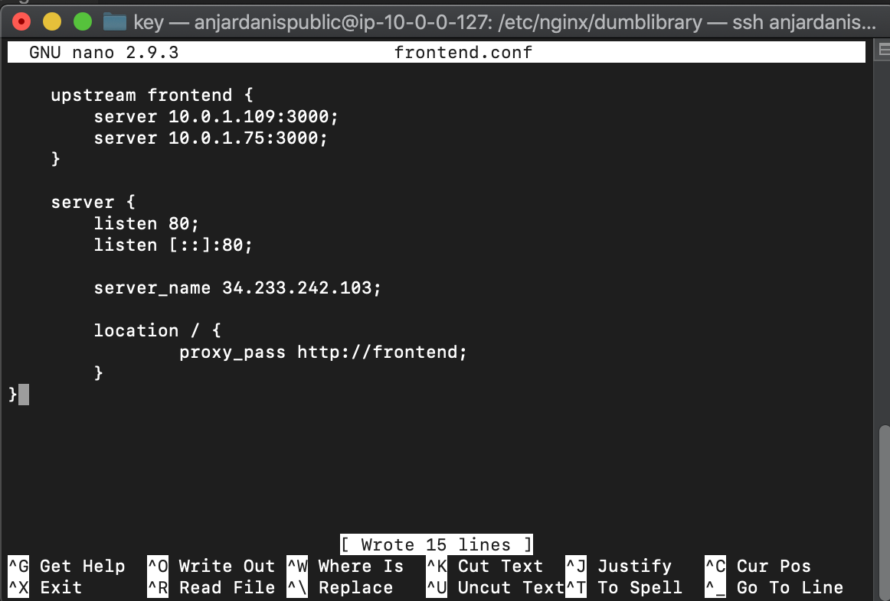
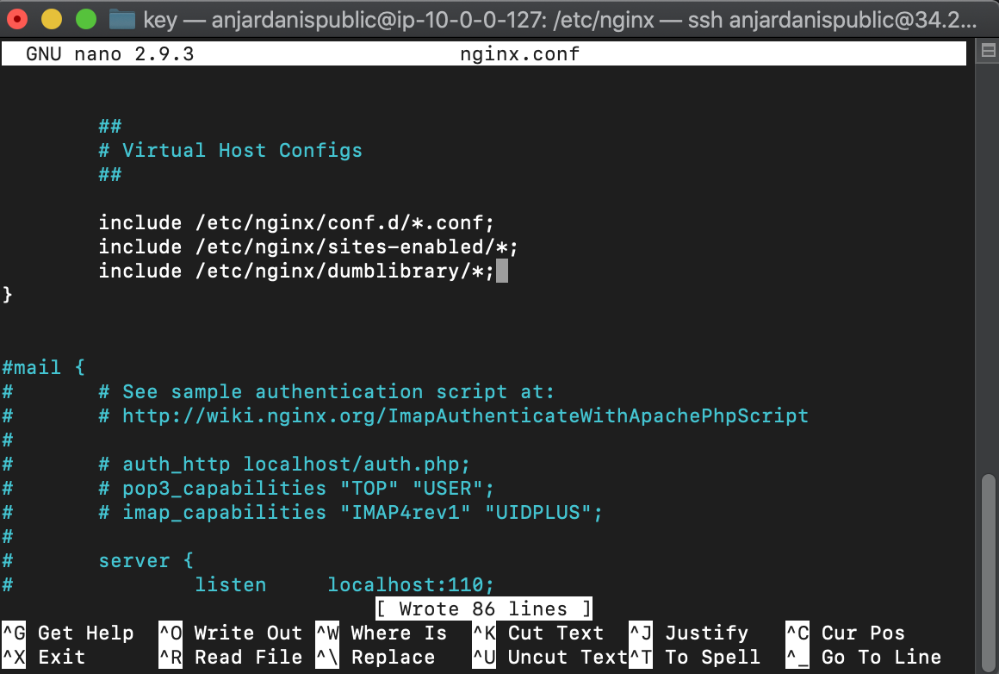
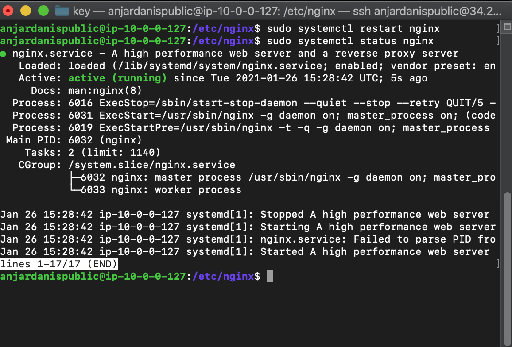
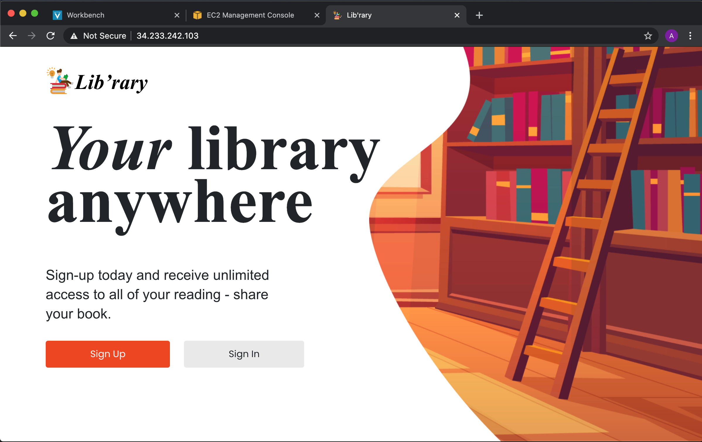

# AWS - Reverse Proxy

## 1. Install Webserver nginx di Reverse Proxy Server
Ubah Nama Public Server Menjadi Reverse Proxy


Update dan Upgrade OS di Reverse Proxy dengan Command
`sudo apt update && sudo apt -y upgrade`


Kemudian Install Nginx dengan Command dan tes pada browser dengan menggunakan Public IPv4 address
`sudo apt -y install nginx`



Kemudian Pindah Ke Direktori `/etc/nginx/` kemudian buat direktori baru `dumblibrary` dan buat file `frontend.conf`


isi file `frontend.conf`
```
    upstream frontend {
        server 10.0.1.109:3000;
        server 10.0.1.75:3000;
    }

    server {
	listen 80;
	listen [::]:80;

	server_name 34.233.242.103;

	location / {
		proxy_pass http://frontend;
	}
}
```


Kemudian tambahkan folder dumblibrary di `nginx.conf`


Restart Nginx dengan command
`sudo systemctl restart nginx`


Hasil Akhir:

