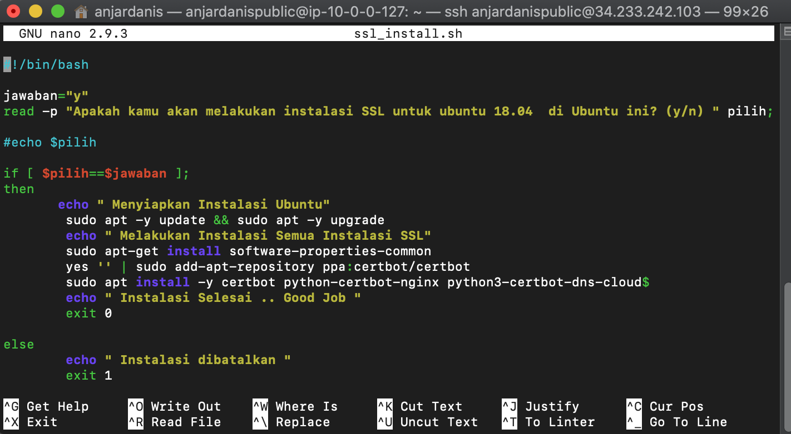
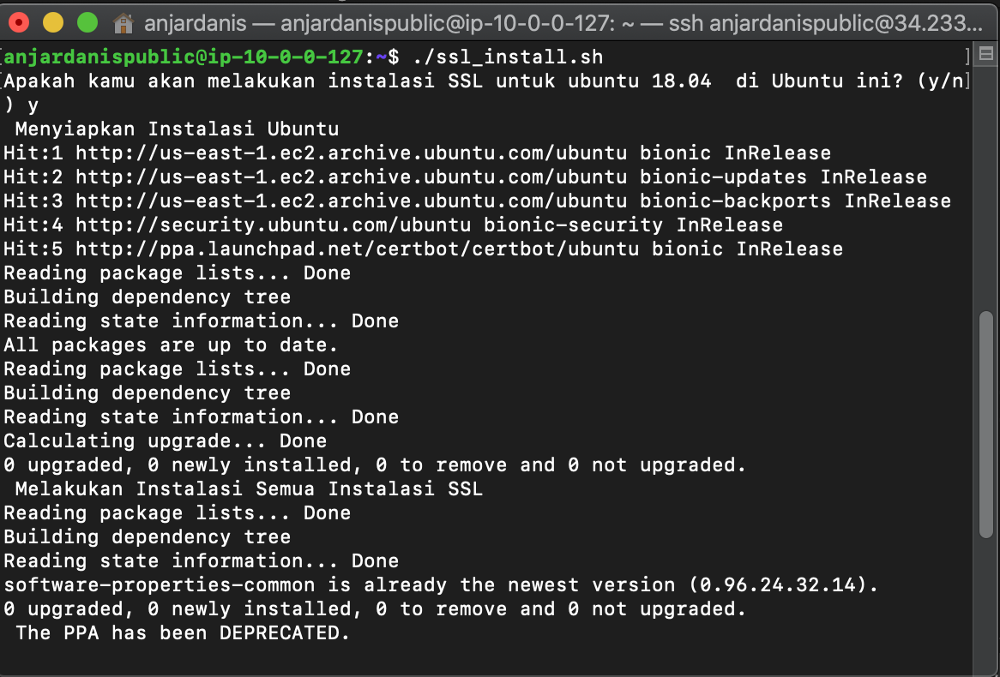
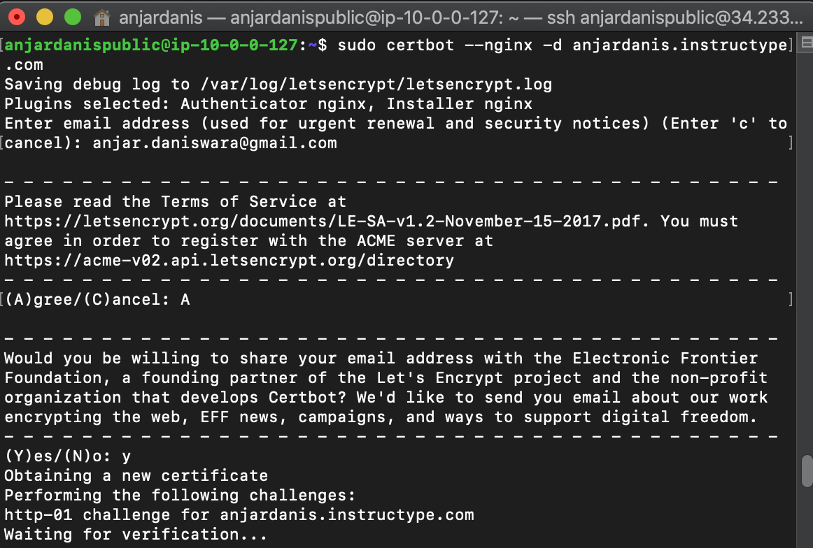
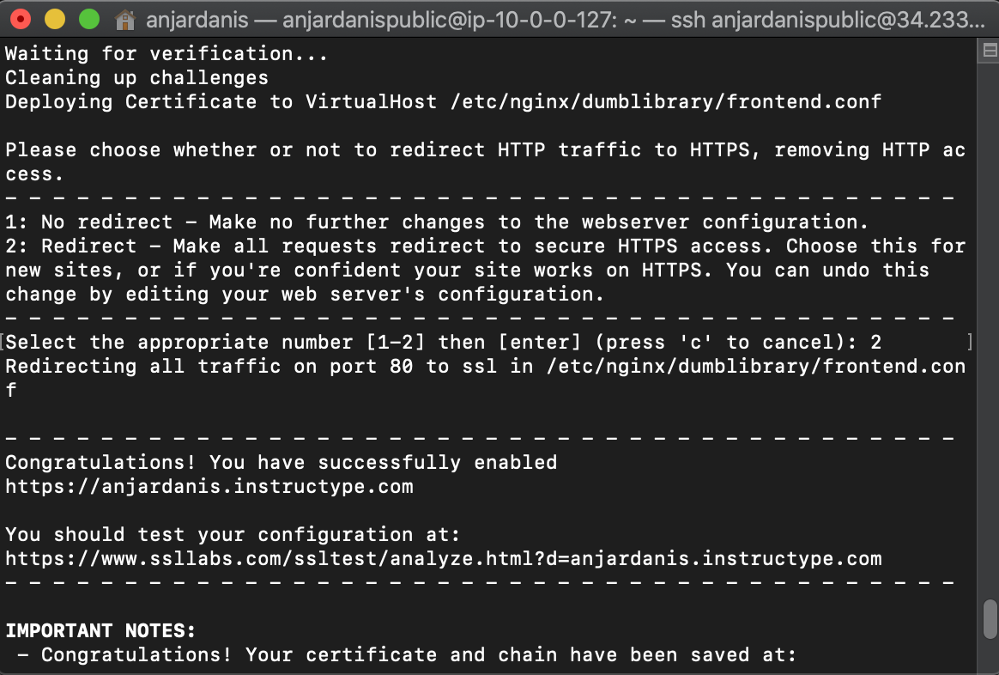
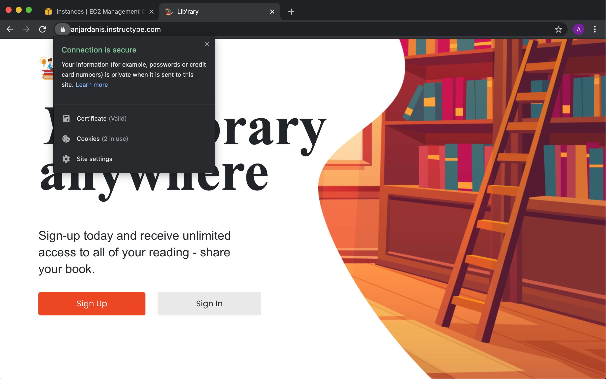

# AWS - SSL Configuration

* #### Buat File ssl_install.sh dan isi file
```
#!/bin/bash

jawaban="y"
read -p "Apakah kamu akan melakukan instalasi SSL untuk ubuntu 18.04  di Ubuntu ini? (y/n) " pilih;

#echo $pilih

if [ $pilih==$jawaban ];
then
       echo " Menyiapkan Instalasi Ubuntu"
        sudo apt -y update && sudo apt -y upgrade
        echo " Melakukan Instalasi Semua Instalasi SSL"
        sudo apt-get install software-properties-common
        yes '' | sudo add-apt-repository ppa:certbot/certbot
        sudo apt install -y certbot python-certbot-nginx python3-certbot-dns-cloudflare
        echo " Instalasi Selesai .. Good Job "
        exit 0

else
        echo " Instalasi dibatalkan "
        exit 1
fi
```


* #### Kemudian modifikasi file dan Jalankan file dengan command
```
chmod +x ssl_install.sh
./ssl_install.sh
```

* #### Masukkan domain milik kita dengan command `sudo certbot --nginx -d anjardanis.instructype.com`


Pilih Agree
Pilih yes

Pilih 2




* #### Hasil Akhir
