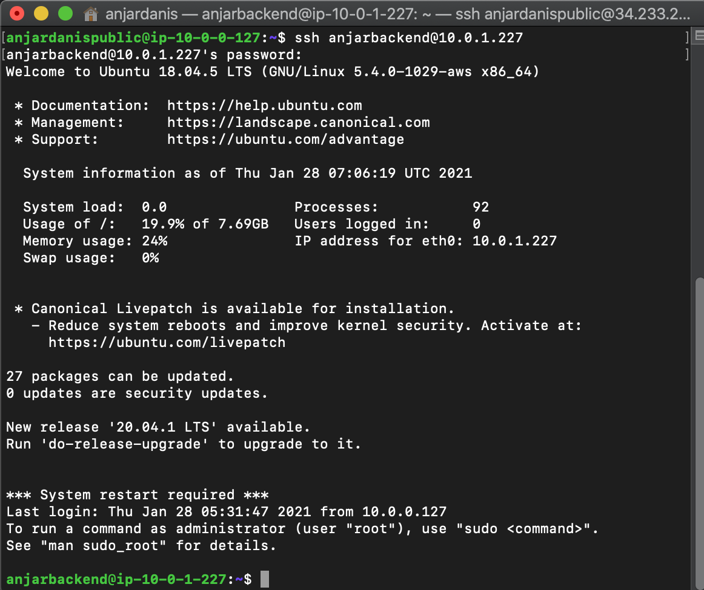
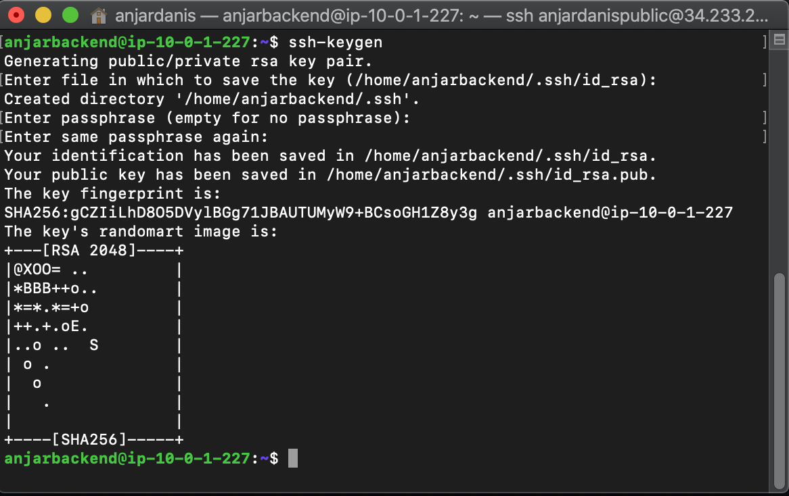
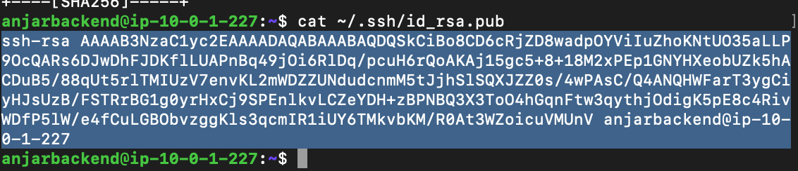
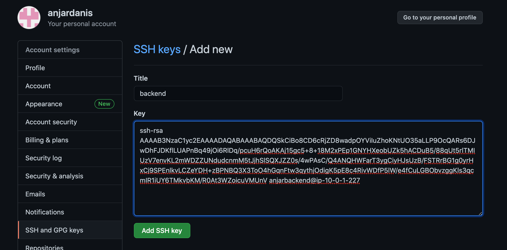
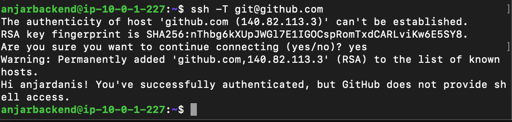

# Install Git and SSH Key

* #### Fork Git Repository yang sudah diberikan 

* #### SSH Ke server backend

* #### Membuat ssh key dengan command `ssh-keygen`

* #### copy key ke github
`cat ~/.ssh/id_rsa.pub`

Masuk ke Github -> Setting -> SSH and GPG Keys -> Klik New SSH Key lalu copy dan klik add SSH key

* #### SSH ke Github dengan command `ssh -T git@github.com`
