* # AWS Setup Database

* ## Konfigurasi Database Server
* #### SSH ke Database Server
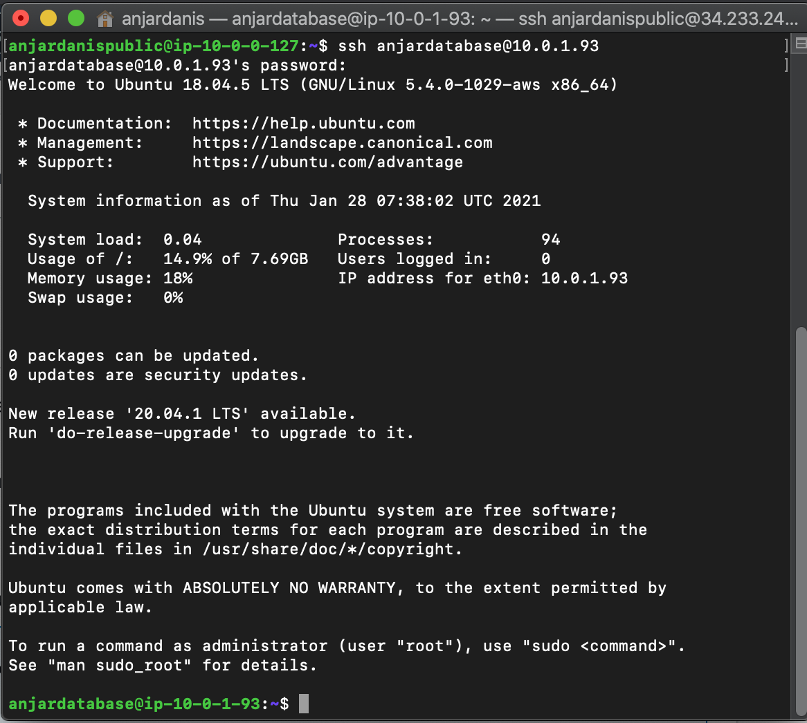

* #### install mysql di database server menggunakan command dan pilih versi 5.7
`wget https://dev.mysql.com/get/mysql-apt-config_0.8.15-1_all.deb`
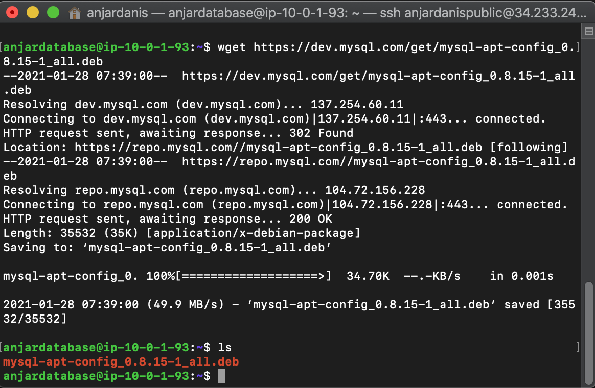

`sudo dpkg -i mysql-apt-config_0.8.15-1_all.deb`
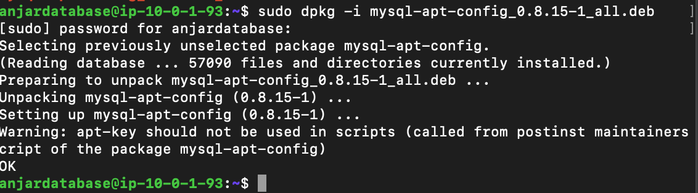
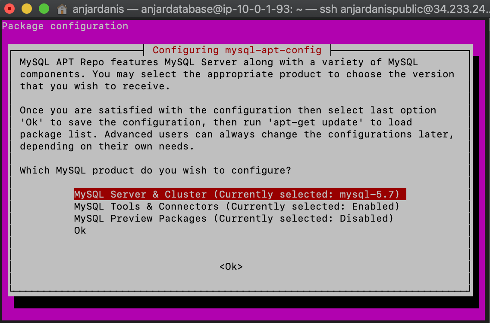

`sudo apt update && sudo apt -y upgrade`
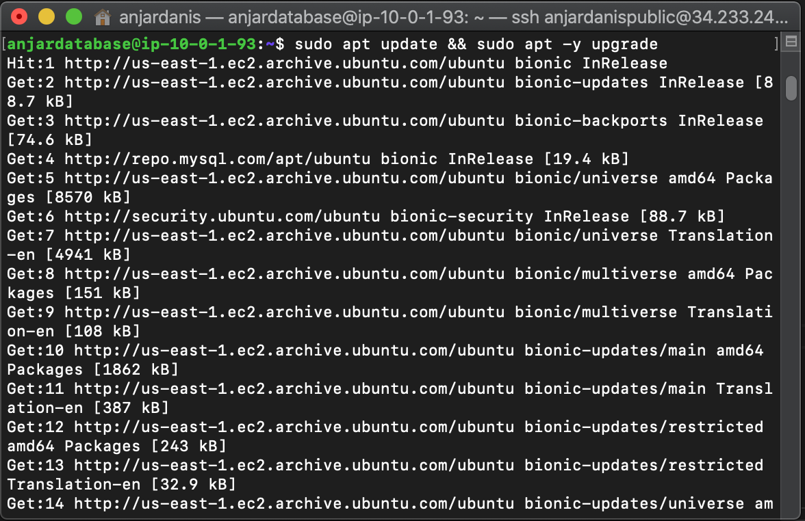

`sudo apt -y install mysql-server` dan isikan password
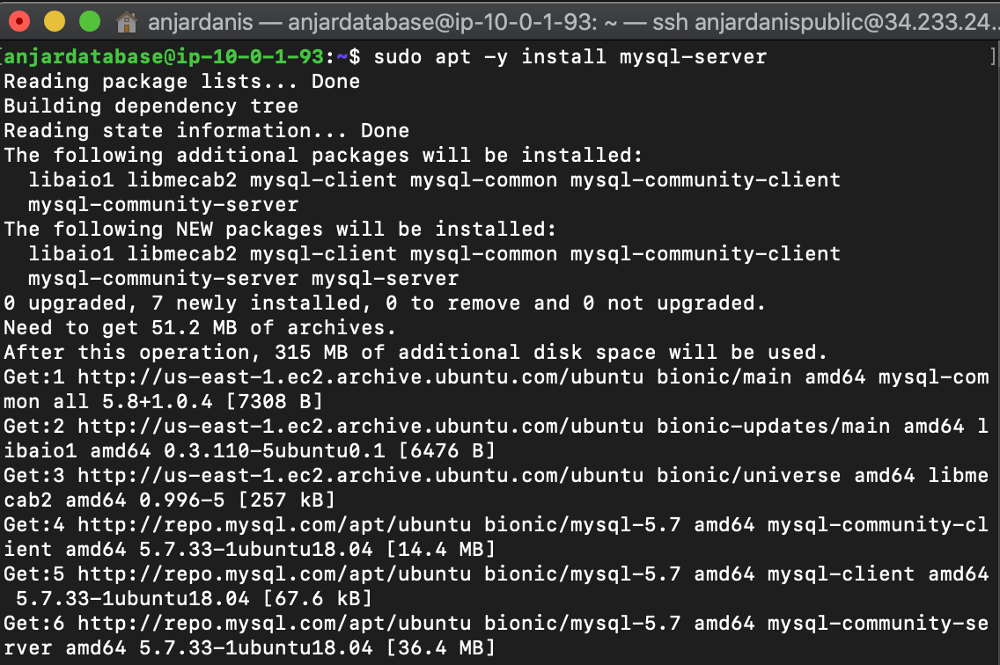
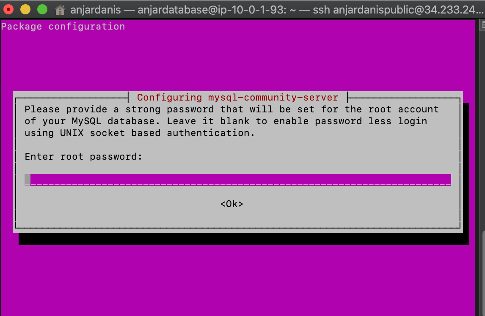

* #### Buat user baru dan inisialisasi dengan backend server

```
mysql -u root -p

CREATE USER 'backend'@'10.0.1.123' IDENTIFIED BY 'anjar'; 

GRANT ALL PRIVILEGES ON *.* TO 'backend'@'10.0.1.123';

FLUSH PRIVILEGES;
```
catatan `'user'@'ip-backend' Identified By 'password';`

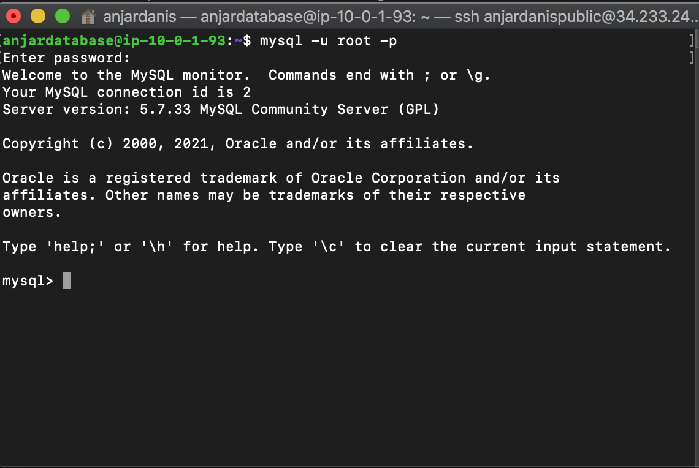
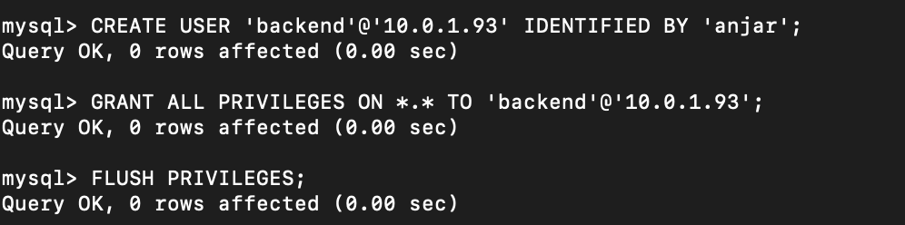

* #### bind ip adress backend dengan database dan ubah ip bind adress menjadi ip Database Server
`sudo nano /etc/mysql/mysql.conf.d/mysqld.cnf` 
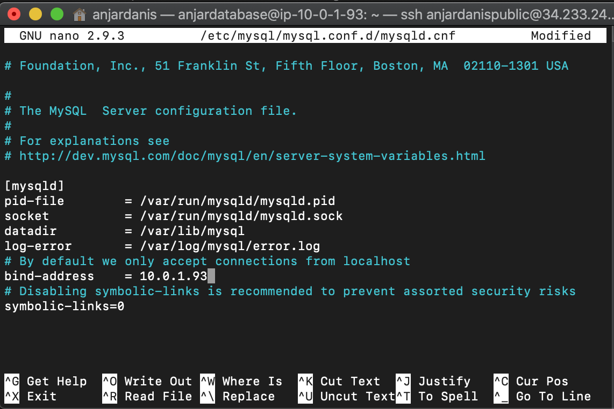

* #### restart mysql
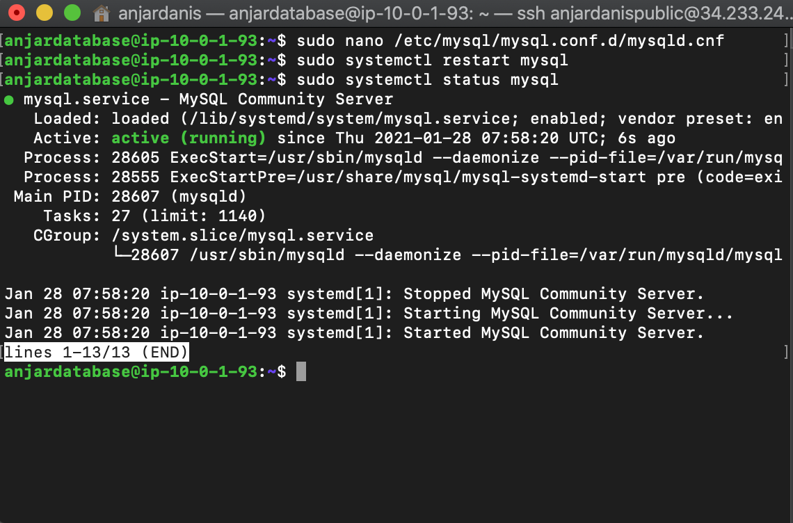

* ## Konfigurasi Backend Server
* #### SSH ke server backend dan install mysql-client dengan command
```
sudo apt-get update

sudo apt-get install -y mysql-client
```
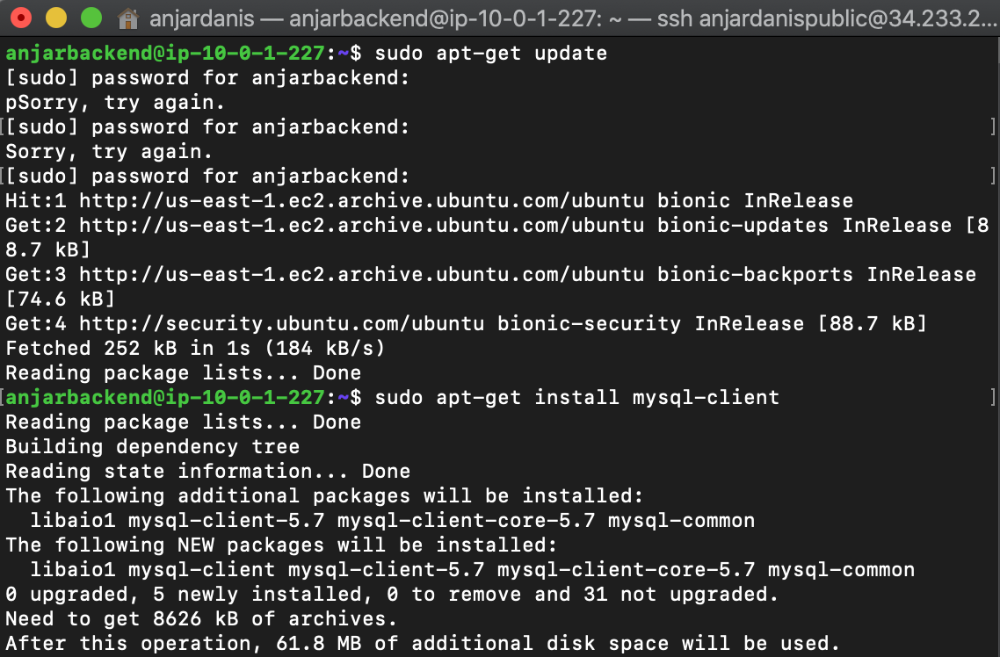

* #### akses database server dari backend server menggunakan command
`mysql -u backend -h 10.0.1.58 -p`
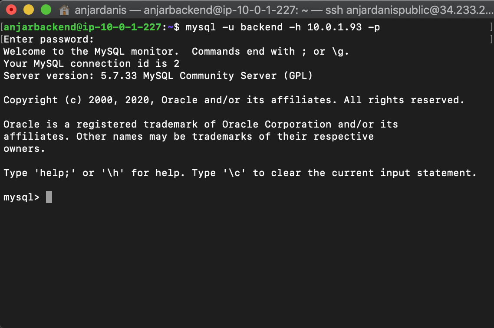