# Deployment Backend

* #### git clone ke repo dikrektori library backend dengan command
`git clone git@github.com:anjardanis/library-backend.git`
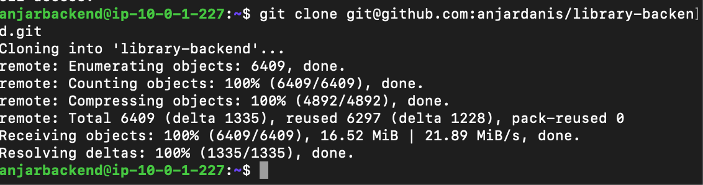

* #### Ubah Branch Menjadi ke Branch Deploy
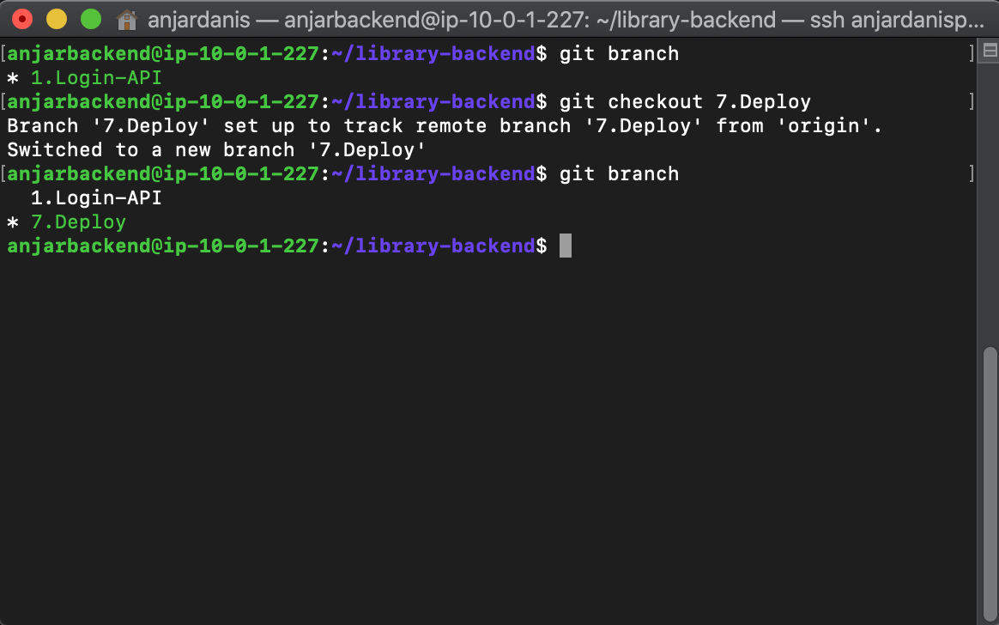

* #### install nodejs versi 10
```
curl -sL https://deb.nodesource.com/setup_10.x | sudo -E bash
sudo apt-get install -y nodejs
```
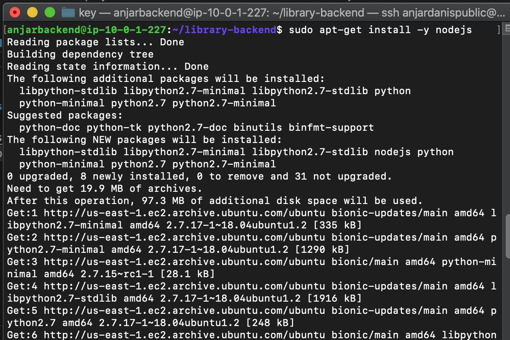

* #### install packages `npm install` dan `npm install nodemon` dan pm2 `sudo npm install -g pm2` dan buat file `ecosystem.config.js`
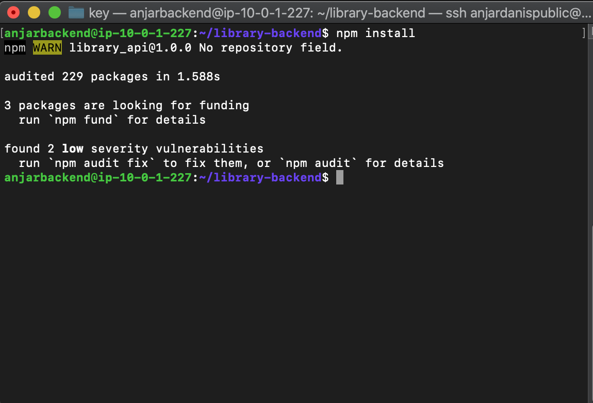
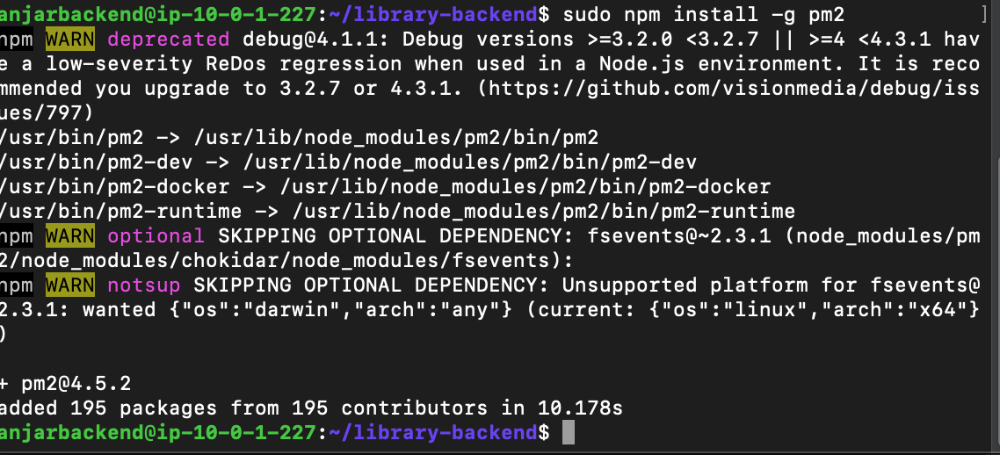

```

module.exports = {
        apps: [
          {
            name: 'library',
            script: 'npm',
            args: 'start'
           }
        ]
};
```

* #### install packages untuk migrate database dengan command `sudo npm install -g sequelize-cli` 
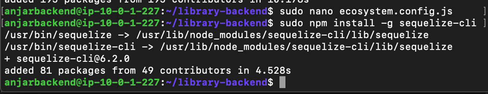

* #### ubah isi file `/config/config.json` dan isi sesuai ip database
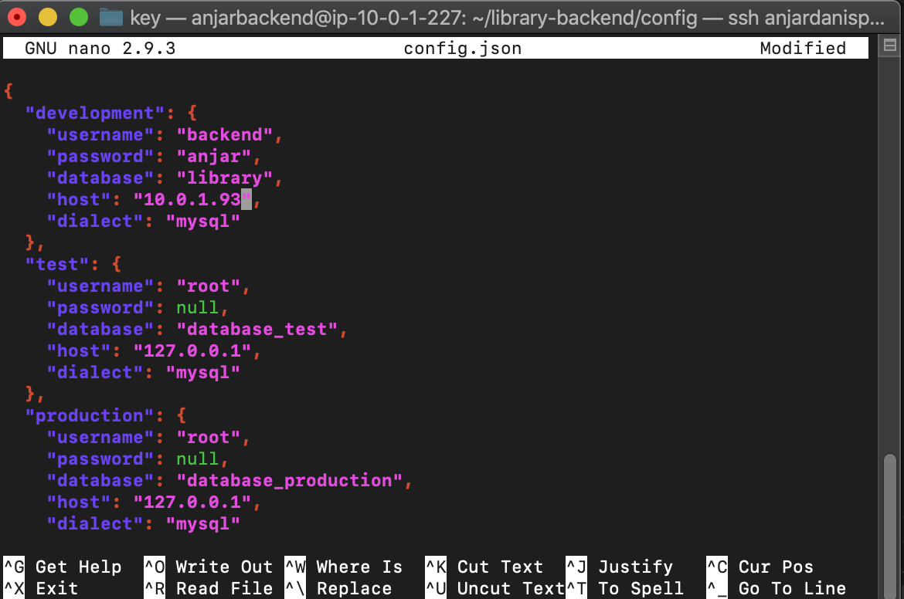

* #### Masuk ke mysql server database dengan command `mysql -u 'username' -h 'ip-server-db' -p` dan buat database dengan command `create database library;`
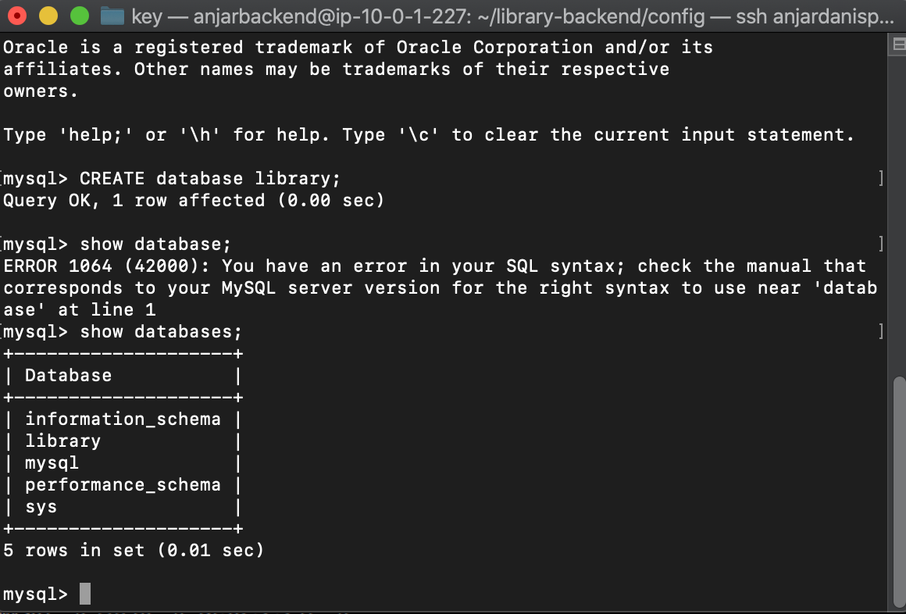

* #### lakukan migrasi database dengan command `sequelize db:migrate all` jika gagal install `sudo npm install -g mysql2` terlebih dahulu
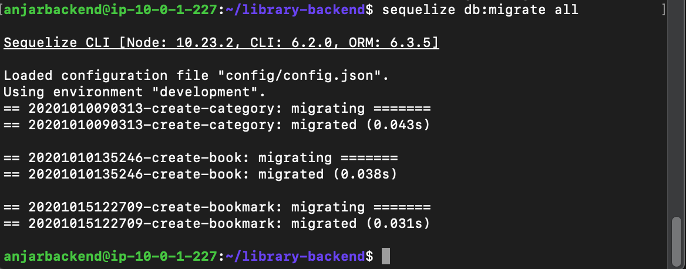

* #### jalankan command `pm2 start ecosystem.config.js`
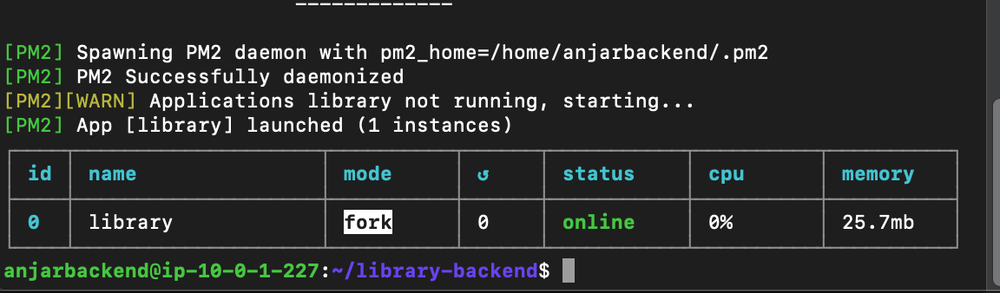

## Pada Frontend Server

* #### edit file di server frontend pada /config/config.js dan ganti base url dengan ip backendserver dan lakukan command `pm2 restart 0`
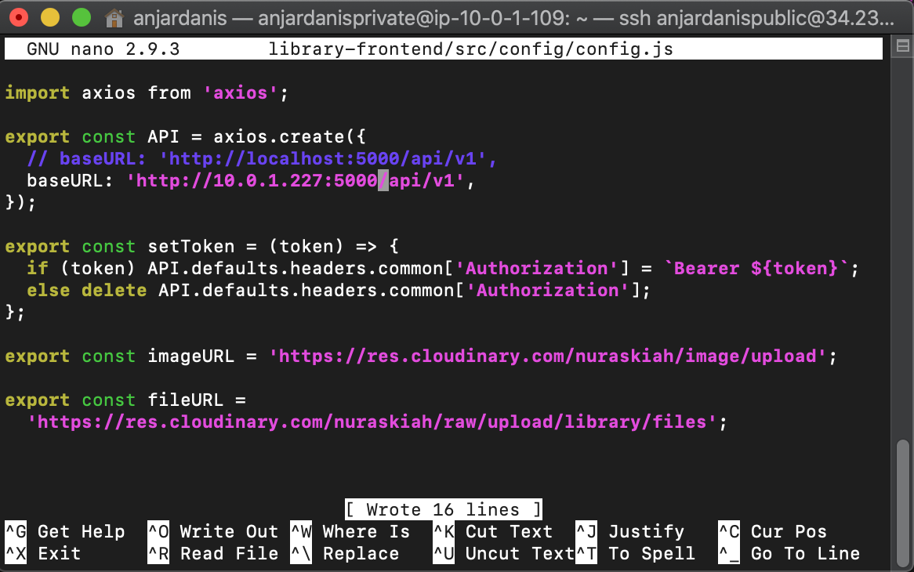
