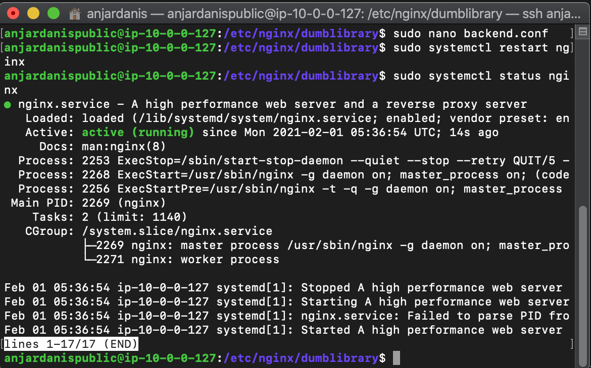

# Reverse Proxy for Backend Application

* #### Buat file backend.conf pada `/etc/nginx/dumblibrary`
```
upstream backend {
        server 10.0.1.126:5000;
        server 10.0.1.201:5000;
    }
 server {
        listen 80;
        listen [::]:80;

        server_name 34.233.242.103;

        location / {
                proxy_pass http://backend;
        }
}

```


* #### kemudian restart nginx


* #### Hasil Output:

