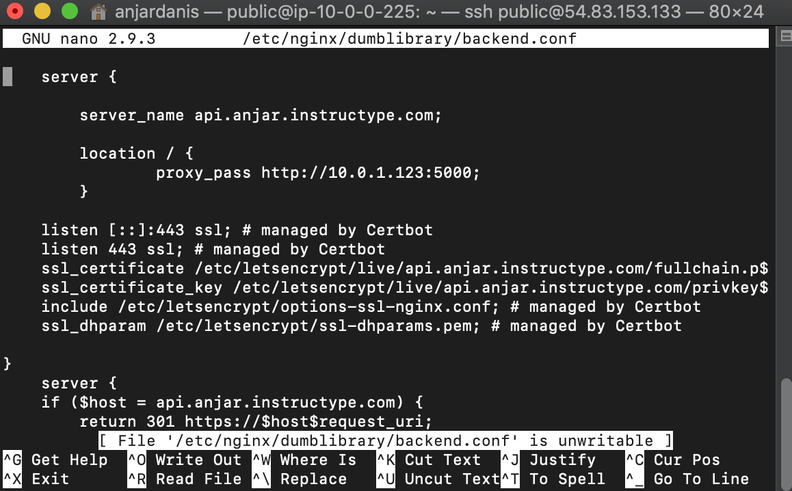

# SSL Configuration for Backend Application

* #### Dikarenakan sudah install lets'encyyrpt packages pada minggu 1 selanjutnya hanya command
```
sudo add-apt-repository ppa:certbot/certbot
sudo apt-get update
sudo apt-get install -y python-certbot-nginx
```
`sudo certbot --nginx -d api.anjar.instructype.com` pilih 2.


* #### ganti file config.js pada frontend bagian base url diganti `https://api.anjar.instructype.com/` dan restart pm2


* #### Hasil Output:
