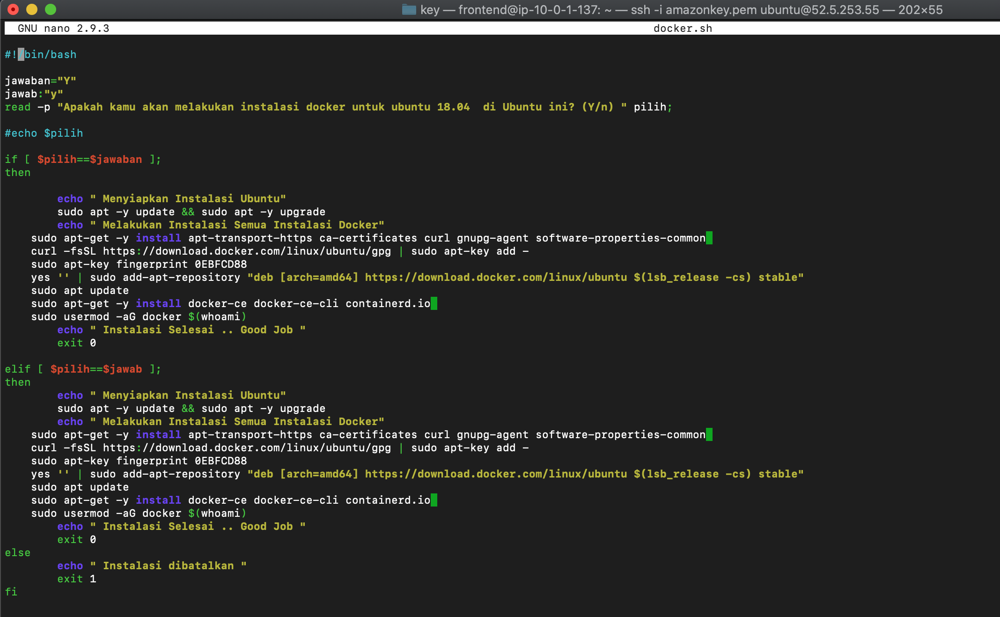
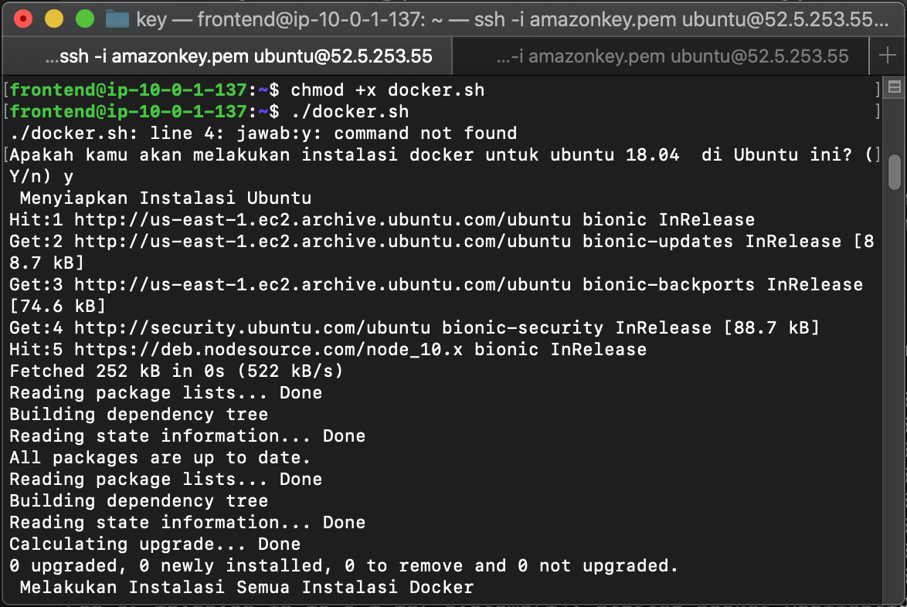
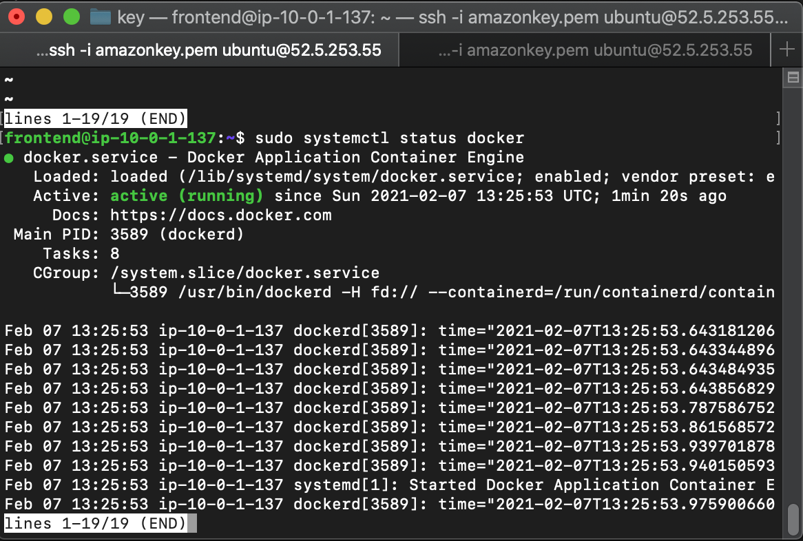
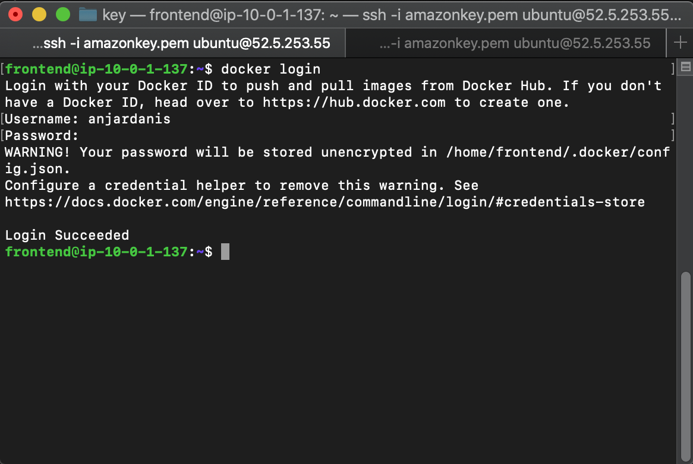
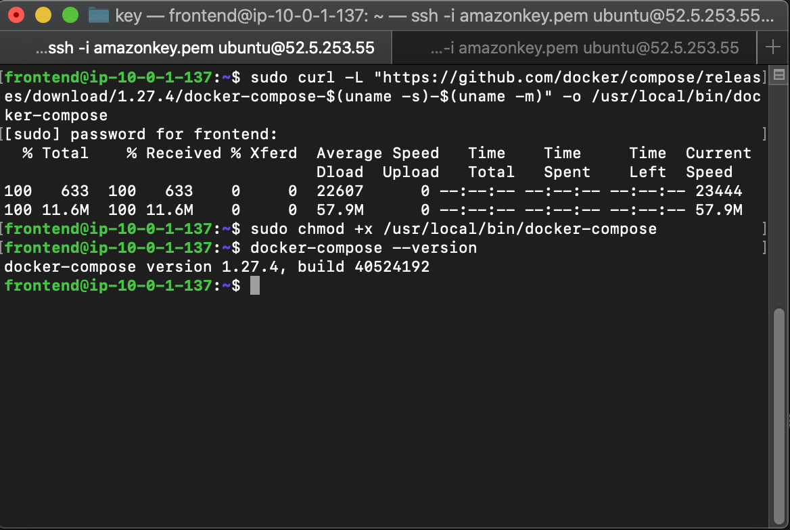

# Install Docker

* #### Buat File docker.sh
```
#!/bin/bash

jawaban="Y"
jawab:"y"
read -p "Apakah kamu akan melakukan instalasi docker untuk ubuntu 18.04  di Ubuntu ini? (Y/n) " pilih;

#echo $pilih

if [ $pilih==$jawaban ];
then

	echo " Menyiapkan Instalasi Ubuntu"
	sudo apt -y update && sudo apt -y upgrade
	echo " Melakukan Instalasi Semua Instalasi Docker"
    sudo apt-get -y install apt-transport-https ca-certificates curl gnupg-agent software-properties-common 
    curl -fsSL https://download.docker.com/linux/ubuntu/gpg | sudo apt-key add -
    sudo apt-key fingerprint 0EBFCD88
    yes '' | sudo add-apt-repository "deb [arch=amd64] https://download.docker.com/linux/ubuntu $(lsb_release -cs) stable"
    sudo apt update
    sudo apt-get -y install docker-ce docker-ce-cli containerd.io 
    sudo usermod -aG docker $(whoami)
	echo " Instalasi Selesai .. Good Job "
	exit 0

elif [ $pilih==$jawab ];
then
	echo " Menyiapkan Instalasi Ubuntu"
	sudo apt -y update && sudo apt -y upgrade
	echo " Melakukan Instalasi Semua Instalasi Docker"
    sudo apt-get -y install apt-transport-https ca-certificates curl gnupg-agent software-properties-common 
    curl -fsSL https://download.docker.com/linux/ubuntu/gpg | sudo apt-key add -
    sudo apt-key fingerprint 0EBFCD88
    yes '' | sudo add-apt-repository "deb [arch=amd64] https://download.docker.com/linux/ubuntu $(lsb_release -cs) stable"
    sudo apt update
    sudo apt-get -y install docker-ce docker-ce-cli containerd.io 
    sudo usermod -aG docker $(whoami)
	echo " Instalasi Selesai .. Good Job "
	exit 0
else
	echo " Instalasi dibatalkan "
	exit 1
fi
```
Ket :
```
- apt-transport-https = tansfer file dan data melalui https.
- ca-certificates = untuk cek sertifikat keamanan
- curl = transfer data
- software-properties-common = script untuk mengelola software.
```


* #### Ubah Modifikasi dan Jalanankan dengan command
```
chmod +x docker.sh
./docker.sh
```


* #### Status Docker


* #### Login ke Docker



# Install Docker Compose

* #### Instal Docker Compose dengan command
```
sudo curl -L "https://github.com/docker/compose/releases/download/1.27.4/docker-compose-$(uname -s)-$(uname -m)" -o /usr/local/bin/docker-compose

sudo chmod +x /usr/local/bin/docker-compose

docker-compose --version
```
