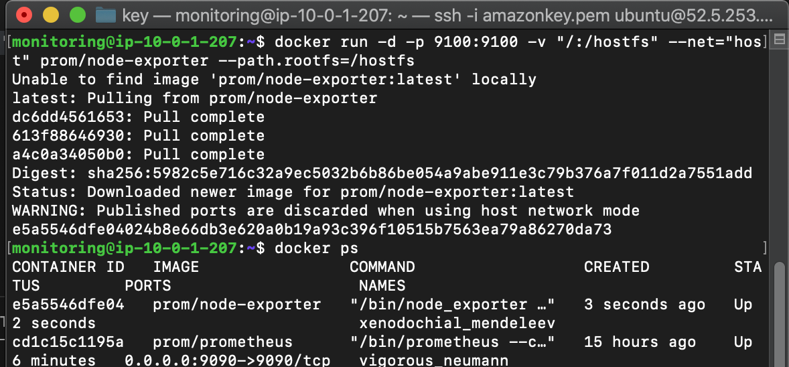
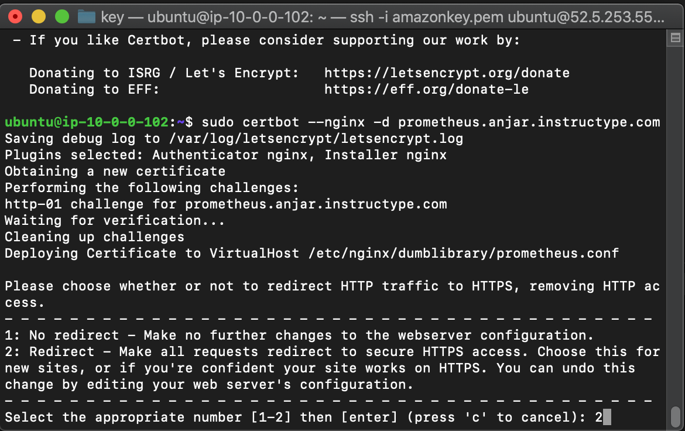
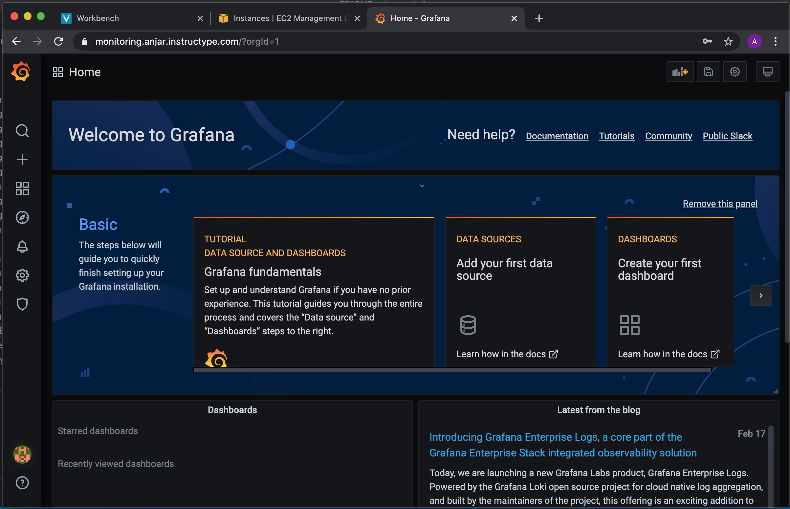

# Setup Monitoring Server

* #### Security Group Monitoring Server


* #### Install Docker pada Monitoring Server


* #### Buat user prometheus dan direktori kebutuhan prometheus dengan command
```
sudo useradd -rs /bin/false prometheus
sudo mkdir /etc/prometheus
sudo mkdir -p /data/prometheus
```


* #### Buat file `prometheus.yml`
```
cd /etc/prometheus/ && sudo touch prometheus.yml
```


* #### Ubah permissions dengan command
```
sudo chown prometheus:prometheus /data/prometheus /etc/prometheus/*
```


* #### Isi file `prometehus.yml`
```
global:
  scrape_interval: 5s
scrape_configs:
  - job_name: 'prometheus'
    static_configs:
      - targets: ['10.0.1.207:9090']
  - job_name: 'node_exporter'
    scrape_interval: 10s
    target_groups:
      - targets: ['10.0.1.207:9100']
```


* #### Jalankan Prometheus di docker dengan command
```
docker run -p 9090:9090 -d -v /etc/prometheus:/etc/prometheus prom/prometheus
```


* #### Install Node-Exporter di docker dengan command
```
docker run -d --net="host" --pid="host" -v "/:/host:ro,rslave" quay.io/prometheus/node-exporter --path.rootfs=/host
```


* #### Edit file `prometheus.yml` dan tambahkan node exporter


* #### cek pada prometheus


* #### Install Grafana di docker dengan command
```
docker run -d -p 3000:3000 --net=host grafana/grafana
```


* #### Tambahkan Config pada Reverse Proxy dan lakukan configure SSL dengan command `sudo certbot --nginx -d monitoring.anjar.instructype.com` dan `sudo certbot --nginx -d prometheus.anjar.instructype.com`
```
 server {
        listen 80;
        listen [::]:80;

        server_name monitoring.anjar.instructype.com;

        location / {
                proxy_pass http://10.0.1.207:3000;
        }
}
```




* #### Masuk ke `monitoring.anjar.instructype.com` login ke grafana default login admin pass admin
