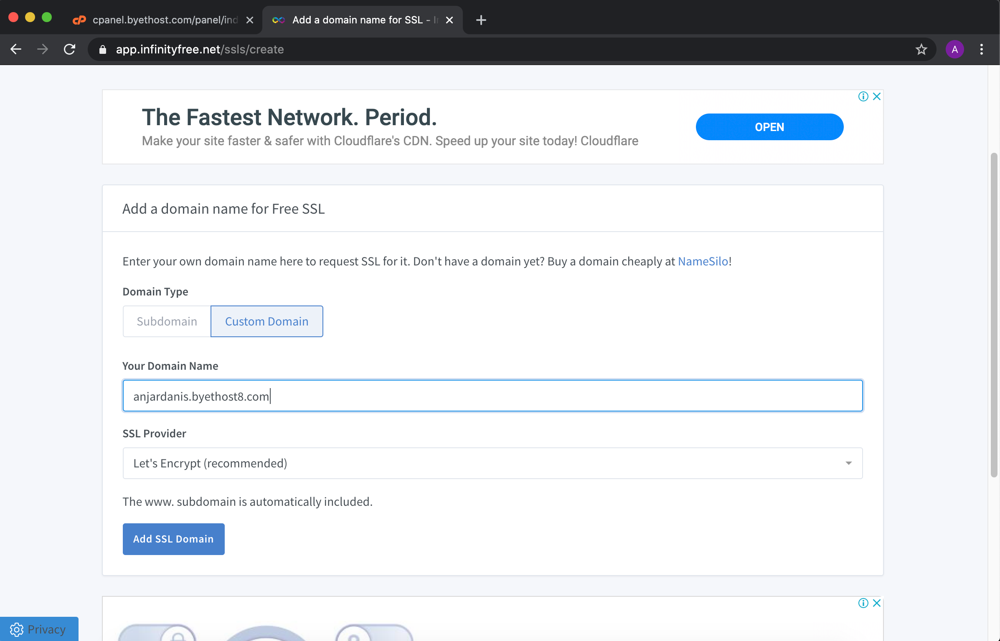
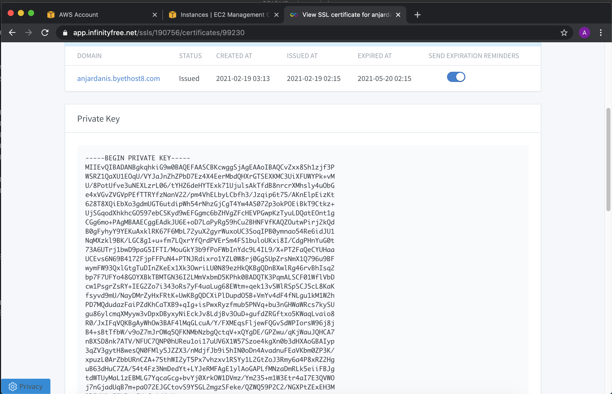

# Deploy PHP Cpanel

* #### Daftar hosting di `https://byet.host/free-hosting/news`

* #### Download File Vanilla Forum

* #### Upload file vanilla forum ke infinityfree menggunakan filezilla

* #### drag semua isi file package vanilla forum

* #### Buat database dan install vanilla forums melalui domain yang sudah didaftarkan

* #### Install SSL pada cpanel

* #### pada infinity tab ssl add SSL domain

* #### tambahkan di CNAME record di cpanel

* #### Kemudian Klik request SSL Certificate dan Tunggu Private Keynya Muncul

* #### Tambahkan pada SSL cpanel

* #### cek website
